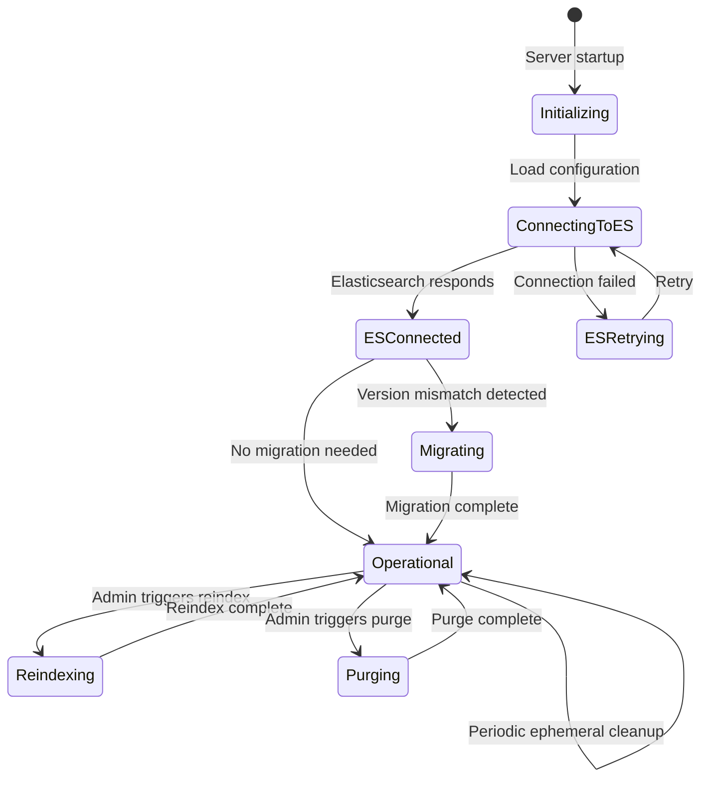
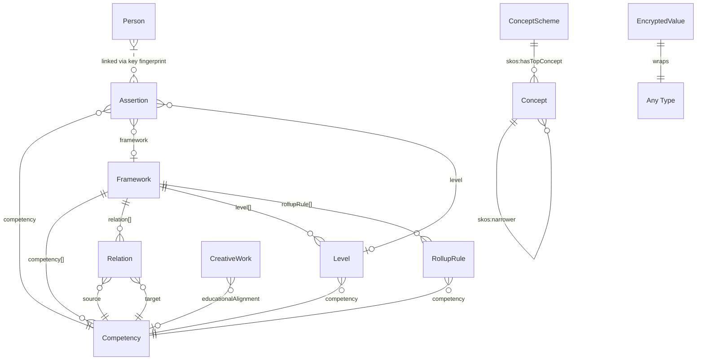
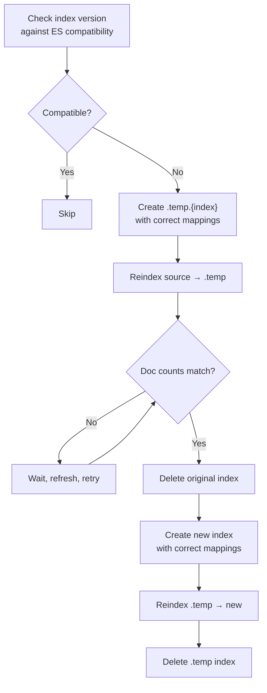
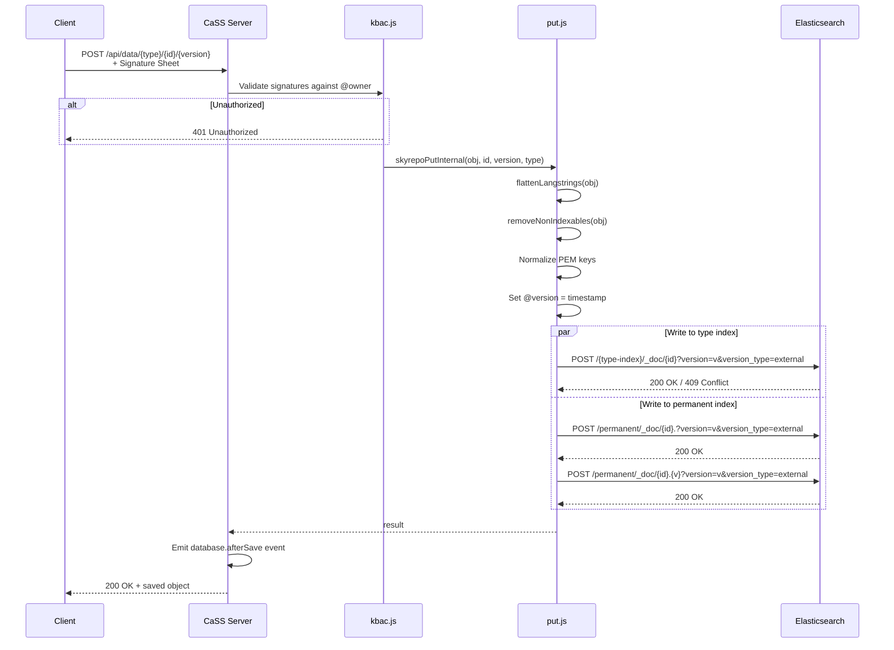

# CaSS Database Design

## Document Number, Volume Number

## Eduworks Corporation

Conforms to DI-IPSC-81437A.
Licensed under the Apache License, Version 2.0.

**AUTHORS**

| Name | Role | Department |
| ---- | ---- | ---------- |
| Auto-generated | AI-assisted analysis | Engineering |

**DOCUMENT HISTORY**

| Date | Version | Document Revision Description | Document Author |
| :--: | :-----: | ----------------------------- | --------------- |
| 2026-06-14 | 1.0 | Initial comprehensive database design document, generated from codebase analysis of CaSS server, cassproject npm package, and cass-editor. | Auto-generated |
| 2026-06-14 | 1.1 | Reviewed by lead architect. Corrected Person↔Assertion linkage (indirect via key fingerprint, not direct URL). Added section on unofficial linked data support (§4.4). | Ronald "Fritz" Ray |

**APPROVALS**

| Approval Date | Approved Version | Approver Role | Approver |
| ------------- | ---------------- | ------------- | -------- |
| 2026-06-14 | 1.1 | Lead Architect / Developer | Ronald "Fritz" Ray |

**SUPPLEMENTAL DOCUMENTS**

| Supplement Date | Supplement Version | Document File Name / Link | Document Name |
| --------------- | ------------------ | ------------------------- | ------------- |
| | | [DESIGN.md](DESIGN.md) | System Design Document (DI-IPSC-81435A) |
| | | [REQUIREMENTS.md](REQUIREMENTS.md) | Software Requirements Specification (DI-IPSC-81433A) |
| | | [ENVIRONMENT.md](ENVIRONMENT.md) | Environment Variable Reference |
| | | [FILE.md](FILE.md) | File Structure Reference |

---

**Table of Contents**

- [1. Scope](#1-scope)
  - [1.1 Identification](#11-identification)
  - [1.2 System Overview](#12-system-overview)
  - [1.3 Document Overview](#13-document-overview)
- [2. Referenced Documents](#2-referenced-documents)
- [3. Database-wide Design Decisions](#3-database-wide-design-decisions)
  - [3.1 Inputs](#31-inputs)
  - [3.2 Outputs](#32-outputs)
  - [3.3 Stimulus / Response](#33-stimulus--response)
  - [3.4 Safety](#34-safety)
  - [3.5 Security](#35-security)
  - [3.6 Privacy](#36-privacy)
  - [3.7 System States](#37-system-states)
  - [3.8 Performance](#38-performance)
  - [3.9 Algorithms](#39-algorithms)
  - [3.10 Rules](#310-rules)
  - [3.11 Error Handling](#311-error-handling)
  - [3.12 Data Storage](#312-data-storage)
  - [3.13 Flexibility](#313-flexibility)
  - [3.14 Availability](#314-availability)
  - [3.15 Maintainability](#315-maintainability)
  - [3.16 Horizontal Scaling](#316-horizontal-scaling)
  - [3.17 Vertical Scaling](#317-vertical-scaling)
  - [3.18 Access](#318-access)
  - [3.19 Consistency](#319-consistency)
  - [3.20 Synchronization](#320-synchronization)
  - [3.21 Integrity](#321-integrity)
  - [3.22 Redundancy](#322-redundancy)
- [4. Database Design (Data Model Design)](#4-database-design-data-model-design)
  - [4.1 Conceptual Model](#41-conceptual-model)
  - [4.2 Logical Model — Elasticsearch Indices](#42-logical-model--elasticsearch-indices)
  - [4.3 Data Elements](#43-data-elements)
- [5. Database Interface](#5-database-interface)
  - [5.1 skyRepo — Core Storage Layer](#51-skyrepo--core-storage-layer)
  - [5.2 ephemeral.js — Ephemeral Store](#52-ephemeraljs--ephemeral-store)
  - [5.3 Filesystem Storage (etc/)](#53-filesystem-storage-etc)
- [6. Requirements Traceability](#6-requirements-traceability)
- [7. Notes](#7-notes)
- [8. Appendixes](#8-appendixes)

---

# 1. Scope

## 1.1 Identification

This document is the Database Design Description (DBDD) for the Competency and Skills System (CaSS). It describes the design of the CaSS data persistence layer, which uses Elasticsearch as its sole database engine and the local filesystem for cryptographic key material.

## 1.2 System Overview

CaSS is an open-source competency management system that stores, manages, and computes relationships between competency frameworks, competencies, assertions of competence, and learner profiles. All data is persisted as JSON-LD documents in Elasticsearch indices. There is no relational database and no ORM — the application communicates directly with Elasticsearch via its HTTP REST API.

## 1.3 Document Overview

This document describes:
- **Section 3:** Database-wide design decisions including security, performance, storage architecture, and scaling.
- **Section 4:** The data model — all Elasticsearch indices, their document structures, and the JSON-LD type hierarchy.
- **Section 5:** The software units that implement database access (the skyRepo layer).
- **Section 6:** Traceability to requirements in REQUIREMENTS.md.

---

# 2. Referenced Documents

| Document Name / Link | Version | Comment |
| :--- | :--- | :--- |
| [DESIGN.md](DESIGN.md) | 1.1 | System Design Document |
| [REQUIREMENTS.md](REQUIREMENTS.md) | 1.1 | Software Requirements Specification |
| [Elasticsearch REST API Documentation](https://www.elastic.co/guide/en/elasticsearch/reference/current/rest-apis.html) | Current | Primary storage backend API reference |
| [JSON-LD 1.1 Specification](https://www.w3.org/TR/json-ld11/) | 1.1 | Data interchange format |
| [DI-IPSC-81437A](DI-IPSC-81437%20Database%20Design%20Descriptions%20Template.md) | A | Database Design Description DID |

---

# 3. Database-wide Design Decisions

## 3.1 Inputs

1. **JSON-LD Objects.** All data written to the database arrives as JSON-LD objects via the CaSS REST API. Objects must contain `@id`, `@type`, and `@context` fields.
2. **Signature Sheets.** Write operations include RSA signature sheets in the HTTP headers for KBAC authorization.
3. **Search Queries.** Elasticsearch query_string syntax via the `/api/custom` search endpoint.
4. **Environment Variables.** Database connection parameters (`ELASTICSEARCH_ENDPOINT`, `CASS_LOOPBACK`, `ELASTICSEARCH_USERNAME`, `ELASTICSEARCH_PASSWORD`) configure the connection at startup.

## 3.2 Outputs

1. **JSON-LD Documents.** All read operations return JSON-LD objects, either individually or as search result arrays.
2. **Version Metadata.** Elasticsearch `_version` fields are returned alongside documents, used for optimistic concurrency control.
3. **Version History.** The `/api/data/{id}/history` endpoint returns an array of all historical versions of an object from the `permanent` index.
4. **Profile Computation Results.** Computed profile trees, cached in the `ephemeral` index as serialized JSON.

## 3.3 Stimulus / Response

1. **HTTP PUT/POST → Elasticsearch Index.** When a JSON-LD object is written via the REST API, the skyRepo layer simultaneously writes to both the type-specific index (for fast retrieval) and the `permanent` index (for version history).
2. **HTTP GET → Elasticsearch Get.** Single-document retrieval uses Elasticsearch's `GET /{index}/_doc/{id}` API.
3. **HTTP POST (search) → Elasticsearch `_search`.** Search requests are translated to Elasticsearch `bool` queries with `query_string` clauses.
4. **HTTP DELETE → Elasticsearch Delete.** Deletes remove the document from the type-specific index only; the `permanent` index retains history.
5. **Periodic Cleanup → Ephemeral Purge.** A `database.periodic` event triggers deletion of expired ephemeral entries using a Painless script that compares `_version` (storing the expiry timestamp) against the current time.

## 3.4 Safety

1. **No Destructive Overwrites.** All writes to the `permanent` index use `version_type=external`, preventing accidental overwrites of existing versions.
2. **Version Conflict Detection.** If an Elasticsearch version conflict (HTTP 409) occurs during a write, the system increments the version timestamp and retries.
3. **Non-Indexable Field Stripping.** Before writing to the type-specific index, the `removeNonIndexables` function strips `payload`, `secret`, `@signature`, and `signature` fields from `EncryptedValue` objects to prevent indexing of sensitive cryptographic material.

## 3.5 Security

1. **KBAC Enforcement on Write.** Before any write operation, the skyRepo layer validates signature sheets against the object's `@owner` array. Only identities whose public key appears in `@owner` (or admin identities) may modify the object.
2. **KBAC Enforcement on Read.** Objects with `@reader` arrays are silently filtered from search results if the requester's signature sheet does not match any entry in `@reader` or `@owner`. This is implemented as a post-retrieval filter in the KBAC layer, not as an Elasticsearch query filter.
3. **Admin Override.** The `skyAdmin2.pem` key and server identity (`skyId.pem`) have universal read/write access to all objects, bypassing KBAC.
4. **Elasticsearch Transport Security.** When `ELASTICSEARCH_UNSAFE=true` is not set, the system uses TLS certificates (`ca.crt`) for Elasticsearch connections. HTTP Basic authentication is supported via `ELASTICSEARCH_USERNAME`/`ELASTICSEARCH_PASSWORD`.
5. **PEM Key Normalization.** Owner and reader PEM keys are normalized (newlines removed) before indexing to ensure consistent matching during KBAC validation.

## 3.6 Privacy

1. **Field-Level Encryption.** Assertion objects encrypt privacy-sensitive fields (`subject`, `agent`, `assertionDate`, `expirationDate`, `negative`, `evidence`, `decayFunction`) as `EcEncryptedValue` sub-objects. These fields are encrypted with AES-256, with the AES key encrypted per-reader using RSA-OAEP.
2. **Encrypted Type Preservation.** When an entire object is encrypted as an `EcEncryptedValue`, the original `@type` is stored as `@encryptedType` so the system can route it to the correct index without decryption.
3. **Search Index Stripping.** Encrypted `payload` and `secret` fields are stripped from the indexed copy of objects (in the type-specific index), preventing full-text search over encrypted content. The unstripped original is preserved in the `permanent` index with mappings disabled.

## 3.7 System States



1. **Initializing.** Server loads environment variables and establishes Elasticsearch connection parameters.
2. **Connecting to ES.** The `database.connected` event is emitted when Elasticsearch responds. The `ephemeral` index is created (with `mappings.enabled: false`) on first connection.
3. **Migrating.** On startup, the server checks all index versions against the Elasticsearch version's `minimum_index_compatibility_version`. Incompatible indices are reindexed via a temp-index swap strategy.
4. **Operational.** Normal CRUD operations. A periodic event triggers ephemeral cleanup.
5. **Reindexing.** Admin-triggered reindexing via `POST /api/util/reindex`.
6. **Purging.** Admin-triggered data purge via `POST /api/util/purge`.

## 3.8 Performance

1. **Index-per-Type.** Each JSON-LD `@type` maps to a dedicated Elasticsearch index, providing type-specific query performance without needing type filters.
2. **Search Exclusion.** The `permanent` index is excluded from wildcard searches (`/*,-permanent`), preventing version history from polluting search results.
3. **Mappings Disabled.** Both `permanent` and `ephemeral` indices are created with `mappings.enabled: false`, reducing indexing overhead for data that is only accessed by `_id`.
4. **Batched Operations.** Multi-get (`_mget`) and multi-put operations are supported, reducing HTTP round-trips.
5. **Graph Caching.** Framework graph structures are cached per-framework in the profile calculator, avoiding redundant graph construction across profile requests.
6. **Ephemeral Caching.** Computed profiles are cached in the `ephemeral` index with a configurable TTL (default 30 days), using Elasticsearch's external versioning to store the expiry timestamp.

## 3.9 Algorithms

1. **Type Inference.** The `inferTypeFromObj` function derives the Elasticsearch index name from an object's `@type` and `@context` fields. The algorithm concatenates `@context + '/' + @type`, strips the protocol prefix (`http://` or `https://`), and replaces `/` and `:` with `.`. Example: `https://schema.cassproject.org/0.4/Framework` → `schema.cassproject.org.0.4.framework` (lowercased).
2. **Version Stamping.** Versions are UTC millisecond timestamps. On write, `@version` is set to `parseInt(version)` or `new Date().getTime()` if unparseable.
3. **Permanent Index Key.** Documents in the `permanent` index use a compound key: `{url-encoded-id}.{version}`. A second "base" entry with key `{url-encoded-id}.` (no version) is also stored to enable latest-version retrieval.
4. **Ephemeral TTL.** The ephemeral store uses Elasticsearch's external versioning creatively: the `version` parameter is set to the expiry timestamp (UTC ms). Periodic cleanup uses a Painless script to delete documents where `doc._version.value < current_time`.
5. **Language Flattening.** Multi-language string objects (e.g., `{"en": "Name", "es": "Nombre"}`) are flattened into simple strings before indexing to prevent dynamic mapping explosion.

## 3.10 Rules

1. **Every JSON-LD object must have `@id`, `@type`, and `@context`.** Objects without a resolvable type cannot be stored.
2. **Index names are derived, never user-specified.** The index is computed from the object's type, not from user input.
3. **Writes are dual-stored.** Every write goes to both the type-specific index and the `permanent` index. This is not configurable.
4. **Deletes are type-index-only.** The `permanent` index is append-only; deletes only remove from the type-specific index.
5. **`permanent` and `ephemeral` have mappings disabled.** These indices store raw data and are not searchable via full-text queries.
6. **Encrypted objects preserve their original type for indexing.** The `@encryptedType` and `@encryptedContext` fields allow the system to store encrypted objects in the correct type-specific index.
7. **Owner/reader fields are PEM-normalized before indexing.** Multi-line PEM keys are compressed to single-line format for consistent matching.
8. **Signature and payload fields are stripped before indexing.** This prevents indexing of cryptographic material in the searchable type-specific index.
9. **Search queries default to all indices except `permanent`.** The default search scope is `/*,-permanent`.
10. **Assertion indices have custom mappings.** Assertion indices define explicit `long` type for `@version`, `float` for `confidence`, and `long` for `assertionDateDecrypted`.
11. **Competency indices have custom mappings.** Competency indices define `ceasn:codedNotation` as a `text` field with a `keyword` sub-field.
12. **ConceptScheme indices have custom mappings.** ConceptScheme indices define `skos:hasTopConcept` as a `text` field with a `keyword` sub-field.

## 3.11 Error Handling

1. **Version Conflict (409).** When a write results in an Elasticsearch 409 (version conflict), the put operation returns the conflict status. The caller may retry with an incremented version.
2. **Not Found.** When a document is not found by direct `_id` lookup, a fallback search (`_search?q=_id:{id}`) is performed across all indices to locate the document.
3. **Mapping Explosion.** During reindexing, the system preserves the `index.mapping.total_fields.limit` setting from the original index to prevent field-count limit errors.
4. **Connection Failure.** Elasticsearch connection failures during startup trigger retry loops. The system will not serve requests until the `database.connected` event fires.

## 3.12 Data Storage

1. **Primary Store: Elasticsearch.** All JSON-LD objects are persisted in Elasticsearch via its HTTP REST API. There is no secondary database.
2. **Filesystem Store: `etc/`.** Cryptographic key material (PEM files, salts, secrets) is stored in the `etc/` directory as flat files. See [§5.3](#53-filesystem-storage-etc).
3. **Docker Volumes.** In containerized deployments, two persistent volumes are defined:
   - `etc` → `/app/etc` (server keys, salts, adapter state)
   - `esdata1` → Elasticsearch data directory

## 3.13 Flexibility

1. **Schema-on-Write.** Elasticsearch dynamically maps new fields as they appear. CaSS does not enforce a fixed schema at the application level — any valid JSON-LD object can be stored.
2. **Type Extensibility.** Any new JSON-LD `@type` will automatically create a new Elasticsearch index. No code changes are required to store new types.
3. **Coprocessor Extensibility.** Profile computation is driven by pluggable coprocessors discovered by filesystem glob; new coprocessors can be added without modifying existing code.

## 3.14 Availability

1. **Stateless Application Layer.** The CaSS server itself is stateless (aside from the `etc/` filesystem). Multiple instances can run against the same Elasticsearch cluster.
2. **Elasticsearch Availability.** CaSS delegates availability to Elasticsearch's own clustering, replication, and shard allocation capabilities. CaSS does not implement application-level replication.

## 3.15 Maintainability

1. **Auto-Migration.** On startup, the server automatically detects Elasticsearch index version incompatibilities and performs a safe reindex via temp-index swap (create `.temp.{index}`, reindex, delete original, reindex back).
2. **Admin Reindex.** The `POST /api/util/reindex` endpoint allows administrators to trigger a manual reindex.
3. **Admin Purge.** The `POST /api/util/purge` endpoint deletes all data from Elasticsearch.
4. **Admin Cull.** The `POST /api/util/cull` and `POST /api/util/cullFast` endpoints remove orphaned data (competencies/relations not referenced by any framework).

## 3.16 Horizontal Scaling

1. **Multiple CaSS Instances.** Multiple CaSS server instances can connect to the same Elasticsearch cluster. The `etc/` volume must be shared (ReadWriteMany in Kubernetes) so all instances use the same server identity and admin keys.
2. **Elasticsearch Clustering.** Elasticsearch natively supports horizontal scaling via sharding and replication. CaSS makes no assumptions about shard count or replica factor.

## 3.17 Vertical Scaling

1. **JVM Heap.** Elasticsearch performance scales with allocated JVM heap memory.
2. **Worker Memory.** Profile computation worker thread memory is configurable via `WORKER_MAX_MEMORY` (default 1024 MB).
3. **Field Limits.** Indices with many dynamic fields may require increasing `index.mapping.total_fields.limit` beyond the default 1000.

## 3.18 Access

All database access is performed by the CaSS server process. There is no direct user access to Elasticsearch. The server exposes CRUD and search operations via its REST API, with KBAC authorization enforced at the application layer.

## 3.19 Consistency

1. **Immediate Consistency.** Write operations use `refresh=true` by default, making documents immediately searchable after write. This can be overridden per-request via the `refresh` query parameter.
2. **Optimistic Concurrency.** External versioning (`version_type=external`) is used for both type-specific and permanent index writes. Elasticsearch rejects writes with a version ≤ the current version.
3. **Eventual Consistency (Multi-Instance).** When multiple CaSS instances write to the same Elasticsearch cluster, consistency is governed by Elasticsearch's own replication model.

## 3.20 Synchronization

1. **No Application-Level Locking.** CaSS does not implement distributed locks. Concurrent writes to the same object are resolved by Elasticsearch's version conflict mechanism.
2. **Conflict Resolution.** On version conflict (HTTP 409), the write is rejected. The application layer may increment the version and retry.

## 3.21 Integrity

1. **Referential Integrity.** CaSS does not enforce referential integrity at the database level. Frameworks reference competencies and relations by URL, but there is no foreign-key constraint. Orphaned references are handled by admin cull operations.
2. **Type Integrity.** The `inferTypeFromObj` function ensures objects are routed to the correct index based on their `@type`. Mistyped objects will create new indices rather than corrupt existing ones.
3. **Signature Integrity.** KBAC signature validation ensures that only authorized identities can modify owned objects.

## 3.22 Redundancy

1. **Dual-Write.** Every object is stored in both the type-specific index (for search/retrieval) and the `permanent` index (for version history). Loss of a type-specific index can be recovered by reindexing from `permanent`.
2. **Elasticsearch Replication.** Elasticsearch replication (configurable via cluster settings) provides data redundancy at the storage layer.

---

# 4. Database Design (Data Model Design)

This section describes the data model at three levels: conceptual (entity relationships), logical (Elasticsearch index structure), and physical (data element details).

## 4.1 Conceptual Model



All entities extend a common base (`EcRemoteLinkedData`) that provides `@id`, `@type`, `@context`, `@owner[]`, `@reader[]`, and `@signature[]`.

> [!IMPORTANT]
> **Person ↔ Assertion linkage is indirect.** Assertions do not contain a direct URL reference to a Person object. Instead, the Assertion's encrypted `subject` field contains the subject's RSA public key (PEM). The Person object's `@id` contains the fingerprint of that same public key. The system correlates the two by deriving the fingerprint from the Assertion's decrypted `subject` PEM and matching it against Person `@id` values. This indirection preserves privacy — the Assertion never reveals *who* its subject is without decryption.

## 4.2 Logical Model — Elasticsearch Indices

### Index Categories

| Category | Index Name Pattern | Mappings | Purpose |
| -------- | ------------------ | -------- | ------- |
| **Type-specific** | `{context.type}` (e.g., `schema.cassproject.org.0.4.framework`) | Dynamic (schema-on-write) | Fast retrieval and full-text search of current object versions |
| **Permanent** | `permanent` | Disabled (`enabled: false`) | Immutable version history of all objects |
| **Ephemeral** | `ephemeral` | Disabled (`enabled: false`) | TTL-based temporary data (profile caches, transient state) |

### Index Name Derivation

The index name is derived from the object's fully-qualified JSON-LD type:

```
@context + '/' + @type
  → strip 'http://' or 'https://'
  → replace '/' and ':' with '.'
  → lowercase
```

**Example:**
```
@context: "https://schema.cassproject.org/0.4"
@type: "Framework"
→ "https://schema.cassproject.org/0.4/Framework"
→ "schema.cassproject.org.0.4.framework"
```

### Known Type-Specific Indices

| Index Name | JSON-LD Type | SDK Class | Description |
| ---------- | ------------ | --------- | ----------- |
| `schema.cassproject.org.0.4.framework` | `https://schema.cassproject.org/0.4/Framework` | `EcFramework` | Competency frameworks |
| `schema.cassproject.org.0.4.competency` | `https://schema.cassproject.org/0.4/Competency` | `EcCompetency` | Individual competencies |
| `schema.cassproject.org.0.4.relation` | `https://schema.cassproject.org/0.4/Relation` | `EcAlignment` | Relationships between competencies |
| `schema.cassproject.org.0.4.assertion` | `https://schema.cassproject.org/0.4/Assertion` | `EcAssertion` | Claims of competence |
| `schema.cassproject.org.0.4.level` | `https://schema.cassproject.org/0.4/Level` | `EcLevel` | Performance levels |
| `schema.cassproject.org.0.4.rolluprule` | `https://schema.cassproject.org/0.4/RollupRule` | `EcRollupRule` | Competence transfer rules |
| `schema.cassproject.org.0.4.directory` | `https://schema.cassproject.org/0.4/Directory` | — | Framework directories |
| `schema.org.person` | `https://schema.org/Person` | `EcPerson` | Person profiles |
| `schema.org.creativework` | `https://schema.org/CreativeWork` | `EcCreativeWork` | Resource alignments |
| `schema.org.organization` | `https://schema.org/Organization` | `EcOrganization` | Organizations |
| `skos.concept` | (SKOS Concept) | `EcConcept` | Taxonomy concepts |
| `skos.conceptscheme` | (SKOS ConceptScheme) | `EcConceptScheme` | Taxonomy concept schemes |
| `ebac.encryptedvalue` | `EncryptedValue` | `EcEncryptedValue` | Fully encrypted objects (routed by `@encryptedType`) |

> [!NOTE]
> Legacy schema versions (0.1–0.3) create separate indices (e.g., `schema.eduworks.com.cass.0.1.competency`). Objects are upgraded to the latest schema version by the SDK's `upgrade()` method when loaded.

### Custom Index Mappings

Certain indices have explicit property mappings applied during creation or migration:

**Assertion indices** (`*assertion`):
```json
{
  "mappings": {
    "properties": {
      "@version": { "type": "long" },
      "confidence": { "type": "float" },
      "assertionDateDecrypted": { "type": "long" }
    }
  }
}
```

**Competency indices** (`*competency`):
```json
{
  "mappings": {
    "properties": {
      "@version": { "type": "long" },
      "ceasn:codedNotation": {
        "type": "text",
        "fields": {
          "keyword": { "type": "keyword", "ignore_above": 256 }
        }
      }
    }
  }
}
```

**ConceptScheme indices** (`*conceptscheme`):
```json
{
  "mappings": {
    "properties": {
      "@version": { "type": "long" },
      "skos:hasTopConcept": {
        "type": "text",
        "fields": {
          "keyword": { "type": "keyword", "ignore_above": 256 }
        }
      }
    }
  }
}
```

**Permanent and Ephemeral indices:**
```json
{
  "mappings": {
    "enabled": false
  }
}
```

## 4.3 Data Elements

### 4.3.1 Common Base Fields (EcRemoteLinkedData)

All CaSS objects inherit these fields:

| Property | Type | Required | Description |
| -------- | ---- | -------- | ----------- |
| `@id` | string (URL) | Yes | Globally unique identifier. Typically `{server}/api/data/{type-path}/{guid}/{version}`. |
| `@type` | string (URL) | Yes | Fully qualified JSON-LD type. Determines the Elasticsearch index. |
| `@context` | string (URL) | Yes | JSON-LD context URL (e.g., `https://schema.cassproject.org/0.4`). |
| `@owner` | string[] (PEM) | No | Array of RSA public keys (PEM format) authorized to modify the object. |
| `@reader` | string[] (PEM) | No | Array of RSA public keys authorized to read the object. If present, restricts visibility. |
| `@signature` | object[] | No | Array of KBAC signatures proving ownership. Stripped before indexing. |
| `@version` | long | Auto | UTC millisecond timestamp used as the Elasticsearch document version. |

### 4.3.2 Framework

| Property | JSON-LD ID | Type | Description |
| -------- | ---------- | ---- | ----------- |
| `name` | `schema:name` | string / langstring | Human-readable name of the framework. |
| `description` | `schema:description` | string / langstring | Description of the framework. |
| `competency` | — | string[] (URL) | URLs of competencies in this framework. |
| `relation` | — | string[] (URL) | URLs of relations in this framework. |
| `level` | — | string[] (URL) | URLs of levels in this framework. |
| `rollupRule` | — | string[] (URL) | URLs of rollup rules in this framework. |
| `directory` | — | string (URL) | URL of the directory this framework belongs to. |

**Security:** May have `@owner` and `@reader`.

### 4.3.3 Competency

| Property | JSON-LD ID | Type | Description |
| -------- | ---------- | ---- | ----------- |
| `name` | `schema:name` | string / langstring | Human-readable name. |
| `description` | `schema:description` | string / langstring | Description. |
| `scope` | — | string | Context in which the competency applies (e.g., "Underwater"). |
| `ceasn:codedNotation` | `ceasn:codedNotation` | string | Coded identifier (e.g., "1.2.3"). Indexed as text+keyword. |
| `requiredSignatureCount` | — | integer | Number of distinct positive signatures required for qualification. |
| `validCondition` | — | string[] (URL) | URLs of SKOS Concepts defining valid assertion conditions. |

**Security:** May have `@owner` and `@reader`.

### 4.3.4 Relation (Alignment)

| Property | JSON-LD ID | Type | Description |
| -------- | ---------- | ---- | ----------- |
| `source` | — | string (URL) | URL of the source competency (A in "A relates-to B"). |
| `target` | — | string (URL) | URL of the target competency (B in "A relates-to B"). |
| `relationType` | — | string | One of: `narrows`, `requires`, `desires`, `isEnabledBy`, `isRelatedTo`, `isEquivalentTo`, `implies`. |
| `validFrom` | — | string (ISO 8601) | Date from which the relation is valid. |
| `validThrough` | — | string (ISO 8601) | Date through which the relation is valid. |

**Security:** May have `@owner` and `@reader`.

### 4.3.5 Assertion

> [!IMPORTANT]
> Assertions contain privacy-sensitive data. Several fields are encrypted as `EcEncryptedValue` sub-objects, meaning their plaintext is only accessible to identities listed as readers/owners of those sub-objects.

| Property | JSON-LD ID | Type | PII | Description |
| -------- | ---------- | ---- | --- | ----------- |
| `competency` | — | string (URL) | No | URL of the competency being asserted. |
| `framework` | — | string (URL) | No | URL of the framework context (optional). |
| `level` | — | string (URL) | No | URL of the level attained (optional). |
| `confidence` | — | float [0,1] | No | Probability of continued demonstration. Indexed as `float`. |
| `subject` | — | EcEncryptedValue\<PEM\> | **Yes** | Encrypted public key of the assertion subject. |
| `agent` | — | EcEncryptedValue\<PEM\> | **Yes** | Encrypted public key of the asserting party. |
| `evidence` | — | EcEncryptedValue\<string\>[] | **Yes** | Encrypted evidence (URLs, JSON, free text). |
| `assertionDate` | — | EcEncryptedValue\<long\> | **Yes** | Encrypted UTC millisecond timestamp of assertion. |
| `expirationDate` | — | EcEncryptedValue\<long\> | **Yes** | Encrypted UTC millisecond timestamp of expiry. |
| `decayFunction` | — | EcEncryptedValue\<string\> | **Yes** | Encrypted confidence decay formula (e.g., `t^2`). |
| `negative` | — | EcEncryptedValue\<boolean\> | **Yes** | Encrypted flag: true = negative assertion. |
| `assertionDateDecrypted` | — | long | No | Server-side decrypted copy of `assertionDate` for search. Indexed as `long`. |

**Security:** Must have `@owner`. Typically has `@reader` for subject and agent access.

### 4.3.6 Level

| Property | JSON-LD ID | Type | Description |
| -------- | ---------- | ---- | ----------- |
| `competency` | — | string (URL) | URL of the competency this level applies to. |
| `title` | — | string | Title one may assume at this level. |
| `performance` | — | string | Textual description of performance characteristics. |

### 4.3.7 RollupRule

| Property | JSON-LD ID | Type | Description |
| -------- | ---------- | ---- | ----------- |
| `rule` | — | string | Source code for the rollup rule (DSL). |
| `competency` | — | string (URL) | URL of the competency this rule applies to. |

### 4.3.8 Permanent Index Document

Documents in the `permanent` index have a distinct structure:

| Property | Type | Description |
| -------- | ---- | ----------- |
| `data` | string (JSON) | The complete JSON-LD object, serialized as a JSON string. |
| `writeMs` | long | UTC millisecond timestamp of when the write occurred. |

**Document ID:** `{url-encoded-object-id}.{version}` (versioned) or `{url-encoded-object-id}.` (base/latest).

### 4.3.9 Ephemeral Index Document

Documents in the `ephemeral` index have arbitrary structure (application-defined). The document `_version` (Elasticsearch external version) stores the expiry timestamp.

| Usage | Document ID Pattern | Content |
| ----- | ------------------- | ------- |
| Profile cache | `{frameworkId}\|{fingerprint}\|{cacheKey}` | Serialized profile computation result |
| Test entry | `test` | `{ "test": "test" }` |

### 4.3.10 EncryptedValue Structure

When a field or entire object is encrypted:

| Property | Type | Description |
| -------- | ---- | ----------- |
| `@type` | string | Always `"EncryptedValue"`. |
| `@encryptedType` | string | Original `@type` of the encrypted object (for routing). |
| `@encryptedContext` | string | Original `@context` of the encrypted object. |
| `payload` | string (Base64) | AES-256 encrypted data. **Stripped before indexing.** |
| `secret` | string[] (Base64) | Per-reader RSA-OAEP encrypted AES keys. **Stripped before indexing.** |
| `@owner` | string[] (PEM) | Owners who can manage the encrypted value. |
| `@reader` | string[] (PEM) | Readers who can decrypt the value. |

## 4.4 Unofficial / Extensible Linked Data Support

The data elements described in §4.3 represent the *officially defined* CaSS types with dedicated SDK classes and known semantics. However, the CaSS storage layer is **type-agnostic by design** — any valid JSON-LD object can be stored, indexed, searched, and retrieved regardless of whether CaSS has a dedicated SDK class for it.

### 4.4.1 How It Works

The skyRepo layer derives the Elasticsearch index name solely from the object's `@type` and `@context` fields (see §3.9, Algorithm 1). It does not validate the type against a whitelist. This means:

1. **Any JSON-LD type creates its own index automatically.** Storing an object with `@type: "ceterms:Credential"` and `@context: "https://purl.org/ctdl/terms/"` will create the index `purl.org.ctdl.terms.ceterms.credential` on first write.
2. **All standard CRUD, search, KBAC, and version history features apply.** The object gets dual-written to its type-specific index and the `permanent` index, owner/reader access control is enforced, and version history is maintained — identically to first-class CaSS types.
3. **No code changes are required.** The server does not need to be modified or restarted to support new types.

### 4.4.2 Known Unofficial Types in Practice

The following type families are commonly stored in CaSS deployments but do not have dedicated CaSS SDK model classes:

| Type Family | Example `@context` | Example `@type` Values | Typical Use |
| ----------- | ------------------- | ---------------------- | ----------- |
| **CTDL (Credential Transparency Description Language)** | `https://purl.org/ctdl/terms/` | `ceterms:Credential`, `ceterms:CredentialOrganization`, `ceterms:LearningOpportunityProfile`, `ceterms:AssessmentProfile`, `ceterms:ConditionProfile`, `ceterms:TransferValueProfile` | Credential registry interoperability via the CTDL-ASN adapter |
| **CTDL-ASN** | `https://purl.org/ctdl/vocabs/` | `ceasn:CompetencyFramework`, `ceasn:Competency` | Competency framework exchange with the Credential Engine registry |
| **schema.org** | `https://schema.org/` | `Person`, `Organization`, `CreativeWork`, `Course`, `EducationalOccupationalCredential`, `AlignmentObject`, `Action`, etc. | General-purpose linked data — schema.org's full vocabulary (~870 types) is available in the SDK, though most are used only when imported from external systems |
| **SKOS** | `https://www.w3.org/2004/02/skos/core#` | `Concept`, `ConceptScheme`, `Collection` | Taxonomies, controlled vocabularies, and condition concepts |
| **Custom / Application-specific** | Any valid URL | Any valid string | Client applications may define their own types for domain-specific data (e.g., training records, badge definitions, curriculum maps) |

### 4.4.3 Implications and Constraints

> [!NOTE]
> While the storage layer accepts any JSON-LD type, higher-level CaSS features (profile calculation, adapters, xAPI integration) only operate on their expected types. Storing a custom type makes it available for CRUD and search, but it will not automatically participate in profile computation or adapter exports.

1. **Dynamic Mapping Risks.** Because Elasticsearch uses dynamic mapping by default, objects with deeply nested or highly variable structures may cause a mapping explosion (exceeding `index.mapping.total_fields.limit`). To mitigate this, CaSS encourages **flat object structures** where objects link to each other by URL reference (`@id`) rather than embedding nested objects inline. This linked-data-by-reference convention keeps individual documents shallow and field counts low. The default field limit is 1000 per index.
2. **No Schema Validation.** CaSS does not validate incoming objects against any JSON-LD schema or SHACL shape. Invalid or malformed objects will be stored as-is.
3. **No Cross-Type Joins.** Elasticsearch does not support relational joins. Relationships between objects of different types are expressed as URL references in the JSON-LD data and resolved by the application layer, not the database.
4. **Index Proliferation.** Each unique `@context`/`@type` combination creates a new Elasticsearch index. Deployments storing many distinct types should monitor index count against Elasticsearch cluster limits.
5. **KBAC Applies Uniformly.** Owner/reader access control applies to all stored objects regardless of type. Custom types benefit from the same cryptographic access control as first-class CaSS types.

---

# 5. Database Interface

## 5.1 skyRepo — Core Storage Layer

The skyRepo module (`src/main/server/skyRepo/`) is the sole interface between the CaSS application and Elasticsearch. All database operations pass through these software units.

### 5.1.1 util.js — Type Inference

| Function | Description |
| -------- | ----------- |
| `getTypeFromObject(o)` | Extracts the fully-qualified type URL from a JSON-LD object by combining `@type` and `@context`. Handles encrypted types via `@encryptedType`/`@encryptedContext`. |
| `inferTypeFromObj(o, atType)` | Converts the fully-qualified type URL into an Elasticsearch index name by stripping protocol and replacing `/`, `:` with `.`. |
| `inferTypeWithoutObj(atType)` | Returns the type string as-is, or `_all` if undefined. |
| `flattenLangstrings(o)` | Flattens multi-language JSON-LD strings (e.g., `{"en": "...", "es": "..."}`) into simple string values for indexing. |

### 5.1.2 put.js — Write Operations

| Function | Description |
| -------- | ----------- |
| `putUrl(o, id, version, type)` | Constructs the Elasticsearch PUT URL for the type-specific index: `{endpoint}/{index}/_doc/{id}?version={v}&version_type=external`. |
| `putPermanentUrl(o, id, version, type)` | Constructs the PUT URL for the permanent index: `{endpoint}/permanent/_doc/{id}.{version}?version={v}&version_type=external`. |
| `putPermanentBaseUrl(o, id, version, type)` | Constructs the PUT URL for the permanent base entry: `{endpoint}/permanent/_doc/{id}.?version={v}&version_type=external`. |
| `skyrepoPutInternalIndex(o, id, version, type)` | Writes to the type-specific index. Flattens langstrings, strips non-indexables, normalizes PEM keys, and sets `@version`. |
| `skyrepoPutInternalPermanent(o, id, version, type)` | Writes to the permanent index. Creates the `permanent` index (with `mappings.enabled: false`) if not yet created. Wraps the object in `{data: JSON.stringify(o), writeMs: ...}`. Writes both base and versioned entries. |
| `removeNonIndexables(o)` | Recursively removes `payload`, `secret`, `signature`, and `@signature` from EncryptedValue sub-objects. |

### 5.1.3 get.js — Read Operations

| Function | Description |
| -------- | ----------- |
| `getUrl(index, id, version, type)` | Constructs the Elasticsearch GET URL. For `permanent` index, appends `.{version}` to the ID. |
| `skyrepoGetIndexInternal(index, id, version, type)` | Performs a direct Elasticsearch GET by `_id` from a specific index. |
| `skyrepoGetIndexSearch(id, version, type)` | Fallback: searches across all indices for a document matching `_id:{id}`. |
| `skyrepoGetIndex(id, version, type)` | Tries direct index lookup first (if type is known), falls back to cross-index search. |
| `skyrepoGetPermanent(id, version, type)` | Retrieves a specific version from the `permanent` index. |

### 5.1.4 delete.js — Delete Operations

| Function | Description |
| -------- | ----------- |
| `skyrepoDeleteInternalIndex(id, version, type)` | Deletes a document from the type-specific index only. The `permanent` index retains all versions. |

### 5.1.5 history.js — Version History

| Function | Description |
| -------- | ----------- |
| `skyrepoHistoryPermanent(id, version, type)` | Searches the `permanent` index for all documents whose `_id` starts with `{id}.` using a Painless script query. Returns up to 10,000 versions. |
| `skyrepoHistoryInternal(id, version, type)` | Parses history results, sorts by timestamp (newest first), deduplicates, and returns an array of JSON-LD objects. |

### 5.1.6 search.js / searchUtil.js — Search Operations

| Function | Description |
| -------- | ----------- |
| `searchUrl(urlRemainder, index_hint)` | Constructs the Elasticsearch `_search` URL. Defaults to `/*,-permanent/_search`. If an `index_hint` is provided (and is not `permanent`), searches only that index. |
| `searchObj(q, start, size, sort, track_scores)` | Builds the Elasticsearch query body with a `bool` query containing a `must` clause with `query_string`. If signature sheets are present, adds a `should` clause matching `owner`/`reader` fields against the signed identities. |

### 5.1.7 kbac.js — Access Control Filter

| Function | Description |
| -------- | ----------- |
| `filterResults(results, signatures)` | Post-retrieval filter that removes objects from search results if the object has `@reader` set and no signature in the sheet matches any `@reader` or `@owner` entry. Objects without `@reader` pass through unfiltered. |

### 5.1.8 multiget.js / multiput.js / multidelete.js — Batch Operations

| Function | Description |
| -------- | ----------- |
| `skyrepoManyGetIndexInternal(index, manyParseParams)` | Performs an Elasticsearch `_mget` request for multiple documents by ID. |
| `skyrepoManyGetPermanent(manyParseParams)` | Batch retrieval from the `permanent` index. |
| Multi-put/delete | Iterates over arrays of objects, applying KBAC per-object, and collecting success/failure counts. |

## 5.2 ephemeral.js — Ephemeral Store

The ephemeral store (`src/main/server/shims/ephemeral.js`) provides a TTL-based key-value cache backed by the Elasticsearch `ephemeral` index.

| Function | Description |
| -------- | ----------- |
| `global.ephemeral.get(id)` | Retrieves a document by `_id` from the `ephemeral` index. |
| `global.ephemeral.gets(ids)` | Batch retrieval via `_mget`. |
| `global.ephemeral.put(id, obj, until)` | Stores a document with expiry. The `until` parameter (UTC ms) is used as the Elasticsearch external version. |
| `global.ephemeral.delete(id)` | Deletes a single document. |
| `global.ephemeral.deleteWith(partOfId)` | Deletes all documents whose `_id` contains the given substring, using a Painless script `_delete_by_query`. Used for cache invalidation (e.g., invalidating all profiles for a subject by fingerprint). |
| Periodic cleanup | Subscribes to `database.periodic` event. Executes a `_delete_by_query` with Painless script: `doc._version.value < current_time`, purging all expired entries. |

## 5.3 Filesystem Storage (etc/)

The `etc/` directory stores cryptographic key material and adapter state as flat files. These are not stored in Elasticsearch.

| File | Purpose | Auto-generated |
| ---- | ------- | -------------- |
| `skyId.pem` | Server identity RSA key pair (PEM). Used as the server's KBAC identity. | Yes, on first startup |
| `skyId.secret` | Admin secret key. | Yes, on first startup |
| `skyAdmin2.pem` | Secondary admin RSA key pair. Grants universal KBAC access. | Yes, on first startup |
| `skyId.salt` | Cryptographic salt for key derivation. | Yes, on first startup |
| `skyId.username.public.salt` | Public salt for username-based key derivation. | Yes, on first startup |
| `skyId.password.public.salt` | Public salt for password-based key derivation. | Yes, on first startup |
| `skyId.secret.public.salt` | Public salt for secret-based key derivation. | Yes, on first startup |
| `adapter.case.private.pem` | CASE adapter identity key pair. | Yes, on first startup |
| `adapter.ceasn.private.pem` | CTDL-ASN adapter identity key pair. | Yes, on first startup |
| `adapter.openbadges.private.pem` | Open Badges adapter identity key pair. | Yes, on first startup |
| `adapter.xapi.json` | xAPI adapter configuration (LRS credentials). | Yes, on first startup |
| `replicateAdapter.pem` | Replication adapter identity key pair. | Yes, on first startup |
| `xapiAdapter.pem` | xAPI adapter RSA key pair. | Yes, on first startup |
| `keys/` | Directory for OIDC-generated user key pairs (when `CASS_OIDC_ENABLED=true`). | Created on demand |

---

# 6. Requirements Traceability

| Requirement Area | Requirement IDs | Database Components |
| ---------------- | --------------- | ------------------- |
| **CRUD Operations** | CRUD-001–CRUD-010 | `put.js` (putInternalIndex, putInternalPermanent), `get.js` (getIndex, getPermanent), `delete.js` (deleteInternalIndex) |
| **Search** | SEARCH-001–SEARCH-010 | `searchUtil.js` (searchUrl, searchObj), `search.js` |
| **Version History** | DATA-003 | `history.js` (skyrepoHistoryPermanent, skyrepoHistoryInternal), `permanent` index |
| **Batch Operations** | DATA-004 | `multiget.js`, `multiput.js`, `multidelete.js` |
| **KBAC Authorization** | SEC-001–SEC-007, SEC-020–SEC-024 | `kbac.js` (filterResults), `put.js` (owner validation) |
| **Privacy / Encryption** | SEC-030–SEC-034 | `put.js` (removeNonIndexables), EncryptedValue structure in `permanent` index |
| **Identity Storage** | IDENT-006–IDENT-008 | `etc/skyId.pem`, `etc/skyId.secret`, `etc/skyAdmin2.pem` |
| **Profile Caching** | PROF-032–PROF-035 | `ephemeral.js` (put, get, deleteWith), `ephemeral` index |
| **Environment Requirements** | ENV-002 | Elasticsearch connection (`ELASTICSEARCH_ENDPOINT`) |
| **Deployment** | PKG-007 | Docker volumes: `etc` → `/app/etc`, `esdata1` → ES data |
| **Admin Utilities** | ADMIN-002–ADMIN-004 | `util.js` (reindex, purge, cull) |
| **Assertion Indexing** | Custom mappings | `util.js` (migration), assertion index mapping (`confidence: float`, `assertionDateDecrypted: long`) |

---

# 7. Notes

## Glossary

| Term | Definition |
| ---- | ---------- |
| CaSS | Competency and Skills System |
| DBDD | Database Design Description |
| Elasticsearch | Distributed search and analytics engine used as CaSS's sole datastore |
| EcRemoteLinkedData | Base class for all CaSS JSON-LD objects, providing `@id`, `@type`, `@context`, `@owner`, `@reader`, `@signature` |
| EcEncryptedValue | Wrapper object for field-level or object-level AES-256/RSA-OAEP encryption |
| JSON-LD | JSON for Linked Data — a W3C standard for expressing linked data in JSON |
| KBAC | Key-Based Access Control — CaSS's RSA signature-based authorization model |
| PEM | Privacy-Enhanced Mail — text encoding format for RSA keys |
| skyRepo | The CaSS data access layer — a set of modules that translate CRUD operations into Elasticsearch REST API calls |
| Type-specific index | An Elasticsearch index named after a JSON-LD type, containing current versions of objects of that type |
| Permanent index | An Elasticsearch index with mappings disabled, storing all historical versions of all objects |
| Ephemeral index | An Elasticsearch index with mappings disabled, storing TTL-based temporary data |

## Acronyms

| Acronym | Expansion |
| ------- | --------- |
| AES | Advanced Encryption Standard |
| API | Application Programming Interface |
| CRUD | Create, Read, Update, Delete |
| DID | Data Item Description |
| ES | Elasticsearch |
| HTTP | Hypertext Transfer Protocol |
| JSON | JavaScript Object Notation |
| JSON-LD | JSON for Linked Data |
| KBAC | Key-Based Access Control |
| OIDC | OpenID Connect |
| PEM | Privacy-Enhanced Mail |
| PII | Personally Identifiable Information |
| REST | Representational State Transfer |
| RSA | Rivest–Shamir–Adleman (cryptosystem) |
| SKOS | Simple Knowledge Organization System |
| SSO | Single Sign-On |
| TLS | Transport Layer Security |
| TTL | Time To Live |
| URL | Uniform Resource Locator |
| UTC | Coordinated Universal Time |

---

# 8. Appendixes

## Appendix A: Index Migration Strategy

When CaSS detects that an Elasticsearch index was created with an incompatible version, it performs the following migration:



Special index types receive their custom mappings during the migration:
- `permanent` / `ephemeral`: `mappings.enabled: false`
- `*assertion`: `@version: long`, `confidence: float`, `assertionDateDecrypted: long`
- `*competency`: `@version: long`, `ceasn:codedNotation: text+keyword`
- `*conceptscheme`: `@version: long`, `skos:hasTopConcept: text+keyword`
- All others: `@version: long`, preserving `total_fields.limit`

## Appendix B: Data Flow — Write Operation


