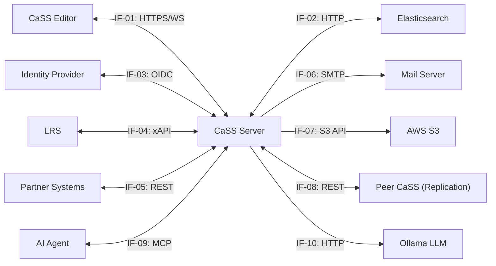

# CaSS — Competency and Skills System

# Software Requirements Specification

# Document CASS-SRS-2026-001

# Eduworks Corporation

Conforms to DI-IPSC-81433A.  
Copyright © 2015–2026 Eduworks Corporation and other contributing parties. Licensed under the Apache License, Version 2.0.

**AUTHORS**

| Name | Role | Department |
| ---- | ---- | ---------- |
| Ronald "Fritz" Ray | Lead Architect / Developer | Engineering |
| Mile Divovic | Developer | Engineering |
| Debbie Brown | Developer | Engineering |
| Elaine Kelsey | Developer | Engineering |
| Kari Glover | Developer | Engineering |
| Tyler Landowski | Developer | Engineering |

**DOCUMENT HISTORY**

| Date | Version | Document Revision Description | Document Author |
| :--: | :-----: | ----------------------------- | --------------- |
| 2026-06-13 | 1.0 | Initial comprehensive SRS, derived from codebase analysis, cassproject npm package, cass-editor, test suite, OpenAPI spec, and docs.cassproject.org. | Auto-generated |
| 2026-06-14 | 1.1 | Reviewed by lead architect. Removed transient version numbers, converted ASCII diagrams to Mermaid, removed OpenSearch references, corrected LEVR definition, clarified native crypto vs. node-forge fallback, distinguished identity management from session authentication (§3.2.4), expanded profile calculation requirements (§3.2.7, PROF-001–043). | Ronald "Fritz" Ray |

**APPROVALS**

| Approval Date | Approved Version | Approver Role | Approver |
| ------------- | ---------------- | ------------- | -------- |
| 2026-06-14 | 1.1 | Lead Architect / Developer | Ronald "Fritz" Ray |

**SUPPLEMENTAL DOCUMENTS**

| Supplement Date | Supplement Version | Document File Name / Link | Document Name |
| --------------- | ------------------ | ------------------------- | ------------- |
| | | [DESIGN.md](DESIGN.md) | System Design Document (DI-IPSC-81435A) |
| | | [CONFIGURATION.md](CONFIGURATION.md) | Configuration Guide |
| | | [DEPLOYMENT.md](DEPLOYMENT.md) | Deployment Guide |
| | | [ENVIRONMENT.md](ENVIRONMENT.md) | Environment Variable Reference |
| | | [FILE.md](FILE.md) | File Structure Reference |
| | | [DATABASE.md](DATABASE.md) | Database Design Description (DI-IPSC-81437A) |

---

**Table of Contents**

- [1. Scope](#1-scope)
  - [1.1 Identification](#11-identification)
  - [1.2 System Overview](#12-system-overview)
  - [1.3 Document Overview](#13-document-overview)
- [2. Referenced Documents](#2-referenced-documents)
- [3. Requirements](#3-requirements)
  - [3.1 States and Modes](#31-states-and-modes)
  - [3.2 Functional Capabilities](#32-functional-capabilities)
  - [3.3 External Interface Requirements](#33-external-interface-requirements)
  - [3.4 Internal Interface Requirements](#34-internal-interface-requirements)
  - [3.5 Internal Data Requirements](#35-internal-data-requirements)
  - [3.6 Adaptation Requirements](#36-adaptation-requirements)
  - [3.7 Safety Requirements](#37-safety-requirements)
  - [3.8 Security and Privacy Requirements](#38-security-and-privacy-requirements)
  - [3.9 Environment Requirements](#39-environment-requirements)
  - [3.10 Computer Resource Requirements](#310-computer-resource-requirements)
  - [3.11 Software Quality Factors](#311-software-quality-factors)
  - [3.12 Design and Implementation Constraints](#312-design-and-implementation-constraints)
  - [3.13 Personnel-Related Requirements](#313-personnel-related-requirements)
  - [3.14 Training-Related Requirements](#314-training-related-requirements)
  - [3.15 Logistics-Related Requirements](#315-logistics-related-requirements)
  - [3.16 Other Requirements](#316-other-requirements)
  - [3.17 Packaging Requirements](#317-packaging-requirements)
- [4. Requirements Traceability](#4-requirements-traceability)
- [5. Notes](#5-notes)
- [6. Appendixes](#6-appendixes)

---

# 1. Scope

## 1.1 Identification

| Attribute | Value |
| --------- | ----- |
| **System Name** | Competency and Skills System (CaSS) |
| **Project-Unique Identifier** | `cass` |
| **CSCI Identifier** | CASS-CSCI-001 |
| **Version / Release** | Current |
| **Repository** | https://github.com/cassproject/CASS |
| **NPM Package Name** | `cassproject` |
| **License** | Apache License 2.0 |
| **Organization** | Eduworks Corporation |
| **Sponsor** | Advanced Distributed Learning (ADL) Initiative, U.S. Department of Defense |

## 1.2 System Overview

CaSS (Competency and Skills System) is an open-source, federated software system for the definition, management, exchange, and computation of competency data. It enables organizations across education, training, and workforce development to author competency frameworks, record assertions of individual competency attainment, compute learner profiles, and exchange competency data with external systems via standards-based protocol adapters.

**History.** CaSS has been developed by Eduworks Corporation since 2015 under sponsorship from the ADL Initiative. Originally implemented in Java, the system was re-architectured to Node.js/Express in the 1.5.x series. The current version uses Express 5, Elasticsearch, and a comprehensive JavaScript SDK (`cassproject` npm package).

**Stakeholders.**

| Role | Organization |
| ---- | ------------ |
| **Sponsor** | ADL Initiative, U.S. DoD |
| **Developer** | Eduworks Corporation |
| **Users** | DoD training organizations, academic institutions, workforce development agencies, credentialing bodies |

**Operating Sites.** CaSS is deployed on-premises, in private/public clouds, and in containerized environments (Docker, Kubernetes) across DoD training organizations, academic institutions, and workforce development programs.

**Related Documents.** See [DESIGN.md](DESIGN.md) for the System Design Document (DI-IPSC-81435A), [CONFIGURATION.md](CONFIGURATION.md), [DEPLOYMENT.md](DEPLOYMENT.md), and [ENVIRONMENT.md](ENVIRONMENT.md).

## 1.3 Document Overview

This Software Requirements Specification (SRS) defines all functional, interface, security, performance, and quality requirements for CaSS. Requirements are derived from analysis of the implemented codebase, the automated test suite, the OpenAPI 3.0 specification, and project documentation.

### Requirements Form

Each requirement specifies, when applicable, the actor, system or component, situation, requirement text, and conditions. Requirements are formatted as:

> **Primary:** The system shall \[action\] when \[condition\].  
> **Secondary:** The \[component\] shall \[sub-requirement\].

### Priority

- **Highest** — Critical for system operation; failure is a blocker.
- **High** — Required for MVP / alpha / sub-1.0 delivery.
- **Medium** — Required for 1.0 delivery.
- **Low** — Desired for post-1.0 delivery.
- **Lowest** — Opportunistic / future enhancement.

### Qualification Provisions

Each requirement is annotated with one or more of:

1. **Demonstration** — Observable functional operation without instrumentation.
2. **Test** — Automated or instrumented testing with data collection.
3. **Analysis** — Processing of accumulated data from other methods.
4. **Inspection** — Visual examination of code, configuration, or documentation.
5. **Special** — Special tools, techniques, or procedures.

---

# 2. Referenced Documents

| Document Name / Link | Version | Comment |
| :--- | :--- | :--- |
| [MIL-STD-498](https://quicksearch.dla.mil/) | 1994 | Military Standard for Software Development and Documentation |
| [DI-IPSC-81433A](https://quicksearch.dla.mil/) | A | Data Item Description — Software Requirements Specification |
| [DI-IPSC-81435A](https://quicksearch.dla.mil/) | A | Data Item Description — System/Subsystem Design Description |
| [W3C JSON-LD 1.1](https://www.w3.org/TR/json-ld11/) | 2020 | JSON-based Linked Data serialization |
| [Schema.org](https://schema.org/) | Current | Shared vocabulary for structured data |
| [CTDL](https://credreg.net/ctdl/terms) | Current | Credential Transparency Description Language |
| [IMS CASE v1.0](https://www.imsglobal.org/activity/case) | 1.0 | Competency and Academic Standards Exchange |
| [xAPI 1.0.3](https://github.com/adlnet/xAPI-Spec) | 1.0.3 | Experience API for learning activity statements |
| [Open Badges 2.0](https://www.imsglobal.org/sites/default/files/Badges/OBv2p0Final/index.html) | 2.0 | Open standard for digital credentials |
| [OpenAPI 3.0](https://spec.openapis.org/oas/v3.0.3) | 3.0.3 | REST API description standard |
| [FIPS 140-3](https://csrc.nist.gov/publications/detail/fips/140/3/final) | 2019 | Security Requirements for Cryptographic Modules |
| [RFC 7519 — JWT](https://www.rfc-editor.org/rfc/rfc7519) | 2015 | JSON Web Token |
| [OpenID Connect Core 1.0](https://openid.net/specs/openid-connect-core-1_0.html) | 2014 | OIDC specification |
| [W3C SKOS](https://www.w3.org/TR/skos-reference/) | 2009 | Simple Knowledge Organization System |
| [Model Context Protocol](https://modelcontextprotocol.io/) | Current | Protocol for AI model–tool integration |
| [DESIGN.md](DESIGN.md) | 1.0 | CaSS System Design Document |
| [ENVIRONMENT.md](ENVIRONMENT.md) | Current | Environment variable reference |
| [swagger.json](src/main/swagger.json) | Current | OpenAPI 3.0 specification |

---

# 3. Requirements

## 3.1 States and Modes

The system operates in the following states. Requirements in this specification are correlated to states where the distinction is material; all requirements without explicit state annotation apply to the **Operating** state.

| State ID | Name | Description |
| :------- | :--- | :---------- |
| ST-INIT | Starting | Express application created; middleware and shims loading in dependency order. No requests accepted. |
| ST-DBCONN | Database Connecting | Elasticsearch connection being established; indices verified and created if missing. No requests accepted. |
| ST-LISTEN | Server Listening | HTTP/HTTPS/HTTP2 server bound to port; core API endpoints available. Adapters not yet loaded. |
| ST-ADLOAD | Adapters Loading | Protocol adapter cartridges being dynamically discovered and loaded via filesystem glob. Core API available; adapter endpoints not yet registered. |
| ST-READY | Ready | All adapters loaded; `server.ready` event emitted. Transient state before entering Operating. |
| ST-OPER | Operating | Steady-state operation. All endpoints available. Periodic maintenance tasks execute every 60 seconds (`server.periodic`, `database.periodic`). |
| ST-DEGRAD | Degraded | One or more adapters disabled (via `DISABLED_ADAPTERS`) or editor disabled (via `DISABLED_EDITOR`). Core API remains fully functional; disabled adapter endpoints return 404. |
| ST-ERROR | Error / Shutdown | Uncaught exception detected. Email alert sent, `EMERGENCY` log entry written, logs flushed, process terminated via `process.exit(1)`. Container orchestrator expected to restart. |

| ID | Requirement | Priority | Evaluation Method |
| :--- | :--- | :--- | :--- |
| ST-001 | The system shall transition through states in the order: ST-INIT → ST-DBCONN → ST-LISTEN → ST-ADLOAD → ST-READY → ST-OPER. | Highest | Test |
| ST-002 | The system shall emit the RxJS event `database.connected` upon successful Elasticsearch connection and index verification. | Highest | Test |
| ST-003 | The system shall not accept HTTP requests until the server has entered ST-LISTEN. | Highest | Demonstration |
| ST-004 | The system shall emit the RxJS event `server.ready` when all adapters have been loaded and the system is fully operational. | Highest | Test |
| ST-005 | The system shall execute periodic maintenance tasks (ephemeral cleanup, disk space monitoring) every 60 seconds during ST-OPER via `server.periodic` and `database.periodic` events. | High | Test |
| ST-006 | The system shall support the ST-DEGRAD state by allowing individual adapters to be disabled via the `DISABLED_ADAPTERS` environment variable (comma-separated list) without affecting core API functionality. | High | Demonstration |
| ST-007 | The system shall support disabling the CaSS editor UI via `DISABLED_EDITOR=true` while leaving all API endpoints operational (ST-DEGRAD). | Medium | Demonstration |
| ST-008 | Upon an uncaught exception (ST-ERROR), the system shall send an email alert (if SMTP is configured), log at `EMERGENCY` severity, flush all logs, and terminate the process with exit code 1. | Highest | Test |

---

## 3.2 Functional Capabilities

### 3.2.1 Data Storage and Retrieval

| ID | Requirement | Priority | Evaluation Method |
| :--- | :--- | :--- | :--- |
| DATA-001 | The system shall store JSON-LD objects in Elasticsearch, using the object's `@type` field (lowercased, dot-delimited) as the index name. | Highest | Test |
| DATA-002 | The system shall retrieve a JSON-LD object via `GET /api/data/{type}/{uid}`, returning the object as a JSON-LD response body with `@context`, `@id`, and `@type` fields. | Highest | Test |
| DATA-003 | The system shall create or update a JSON-LD object via `POST /api/data/{type}/{uid}`, storing it in both the type-specific index and the `permanent` (version history) index. | Highest | Test |
| DATA-004 | The system shall support versioned retrieval via `GET /api/data/{type}/{uid}/{version}`, where `version` is the timestamp of the desired version. | High | Test |
| DATA-005 | The system shall use external versioning (`version_type=external`) in Elasticsearch, using timestamps as version numbers for CaSS-created data. | High | Inspection |
| DATA-006 | The system shall preserve all historical versions of every object in the `permanent` Elasticsearch index, accessible via the `history` query parameter. | High | Test |
| DATA-007 | When an object is deleted via `DELETE` (or POST with delete intent), the system shall remove it from the type-specific index but shall retain version history in the `permanent` index. | High | Test |
| DATA-008 | The system shall emit a `database.afterSave` event via the RxJS event bus after every successful write or delete operation. | High | Test |
| DATA-009 | The system shall support objects with globally unique, persistent URL identifiers as the `@id` field. | Highest | Test |
| DATA-010 | The system shall support cross-repository object mobility: an object created on one repository shall be retrievable and updatable on another repository that knows the object's `@id`. | High | Test |
| DATA-011 | The system shall accept and store any valid JSON-LD object regardless of whether a dedicated SDK model class exists for its `@type`. Storage, indexing, search, KBAC enforcement, and version history shall apply uniformly to all JSON-LD types. | Highest | Test |
| DATA-012 | When an object with a previously unseen `@context`/`@type` combination is stored, the system shall automatically create a new Elasticsearch index derived from the fully-qualified type URL. No server restart or code change shall be required. | Highest | Test |
| DATA-013 | The system shall provide dedicated SDK model classes and custom index mappings for officially supported types: `Framework`, `Competency`, `Relation`, `Assertion`, `Level`, `RollupRule`, `Directory`, `Person`, `Organization`, `CreativeWork`, `Concept`, `ConceptScheme`, and `EncryptedValue`. | High | Inspection |
| DATA-014 | The system shall store and retrieve CTDL types (`ceterms:Credential`, `ceterms:CredentialOrganization`, `ceterms:LearningOpportunityProfile`, `ceterms:AssessmentProfile`, etc.) and CTDL-ASN types (`ceasn:CompetencyFramework`, `ceasn:Competency`) using the same CRUD, search, and access control mechanisms as officially supported types. | High | Test |
| DATA-015 | The system shall store and retrieve schema.org types (`Person`, `Organization`, `CreativeWork`, `Course`, `AlignmentObject`, `Action`, and the full schema.org vocabulary) using the same CRUD, search, and access control mechanisms as officially supported types. | High | Test |
| DATA-016 | The system shall store and retrieve SKOS types (`Concept`, `ConceptScheme`, `Collection`) and any custom application-defined JSON-LD types using the same CRUD, search, and access control mechanisms as officially supported types. | High | Test |
| DATA-017 | The system shall not validate incoming JSON-LD objects against ontology schemas, SHACL shapes, or JSON-LD context definitions. Objects shall be stored as-is with Elasticsearch dynamic mapping applied to their fields. | High | Inspection |

### 3.2.2 Search

| ID | Requirement | Priority | Evaluation Method |
| :--- | :--- | :--- | :--- |
| SRCH-001 | The system shall provide full-text search via `GET /api/sky/repo/search` and `POST /api/sky/repo/search`, accepting Elasticsearch Simple Query String syntax in the `q` parameter. | Highest | Test |
| SRCH-002 | The system shall support pagination via `start` (offset, default 0) and `size` (count, max 10,000) query parameters. | High | Test |
| SRCH-003 | The system shall support result sorting via the `sort` query parameter. | Medium | Demonstration |
| SRCH-004 | The system shall support an `index_hint` query parameter to accelerate searches by targeting a specific Elasticsearch index. | Medium | Test |
| SRCH-005 | The system shall sanitize search queries to prevent Elasticsearch injection, escaping special characters that could alter query semantics. | Highest | Inspection |
| SRCH-006 | The system shall filter search results through KBAC access control, excluding objects for which the requestor lacks read permission, before returning them. | Highest | Test |
| SRCH-007 | The system shall return search results as a JSON array of JSON-LD objects. | High | Test |

### 3.2.3 Batch Operations

| ID | Requirement | Priority | Evaluation Method |
| :--- | :--- | :--- | :--- |
| BATCH-001 | The system shall support batch retrieval via `POST /api/sky/repo/multiGet`, accepting an array of partial identifiers (containing `@id` or URL fragments) and returning an array of matching JSON-LD objects. | High | Test |
| BATCH-002 | The system shall support batch storage via `POST /api/sky/repo/multiPut`, accepting an array of JSON-LD objects, validating KBAC permissions for each, and returning the count of successfully stored objects. | High | Test |
| BATCH-003 | The system shall enforce KBAC write permissions per-object during batch put operations; objects for which the requestor lacks write permission shall be silently excluded from the result and counted as failures. | Highest | Test |
| BATCH-004 | The system shall process batch put operations in configurable batch sizes controlled by the `MULTIPUT_BATCH_SIZE` environment variable (default 100). | Medium | Inspection |
| BATCH-005 | The system shall support batch deletion via `POST /api/sky/repo/multiDelete`, accepting an array of identifiers. | High | Test |

### 3.2.4 Identity Management

> [!IMPORTANT]
> This section describes CaSS's **cryptographic identity management** system — the creation, storage, and retrieval of RSA key pairs that underpin Key-Based Access Control (KBAC). This is distinct from the **session-level authentication** mechanisms (OIDC, JWT, Platform One) implemented in `auth.js` and documented in [§3.8 Security — Authentication](#authentication). The two approaches serve different purposes:
>
> - **Identity Management (this section):** Client-side RSA key pair generation and encrypted credential storage. Users prove identity by signing requests with their private key. Keys are portable and not tied to any external identity provider.
> - **Session Authentication (§3.8):** Server-side session management via external identity providers (OIDC/Keycloak, JWT, Platform One). When enabled, `auth.js` bridges these external sessions into the KBAC model by deterministically mapping authenticated users to server-managed RSA key pairs.

| ID | Requirement | Priority | Evaluation Method |
| :--- | :--- | :--- | :--- |
| IDENT-001 | The system shall create an RSA key pair for a new identity via `POST /api/sky/id/create`, accepting `username`, `password`, and `credentials` fields. | Highest | Test |
| IDENT-002 | The system shall persist identity changes via `POST /api/sky/id/commit`, storing encrypted identity data in Elasticsearch. | Highest | Test |
| IDENT-003 | The system shall retrieve stored identities via `POST /api/sky/id/login`, decrypting stored credentials with the provided username and password. | Highest | Test |
| IDENT-004 | The system shall return cryptographic salts via `GET /api/sky/id/salts`, providing the salts necessary for client-side key derivation. | High | Test |
| IDENT-005 | The system shall return HTTP 422 if identity creation, commit, or login requests are malformed (missing required fields). | High | Test |
| IDENT-006 | The system shall maintain a server identity key pair in `etc/skyId.pem`, auto-generated on first startup if not present. | Highest | Inspection |
| IDENT-007 | The system shall maintain an admin secret key in `etc/skyId.secret`, auto-generated on first startup if not present. | Highest | Inspection |
| IDENT-008 | The system shall maintain a secondary admin key pair in `etc/skyAdmin2.pem`, auto-generated on first startup. | High | Inspection |

### 3.2.5 Health Check

| ID | Requirement | Priority | Evaluation Method |
| :--- | :--- | :--- | :--- |
| HEALTH-001 | The system shall respond to `GET /api/ping` with a JSON object containing at minimum: `ping` ("pong"), `version`, `time`, `adminPublicKeys`, `postMaxSize`, `signatureSheetHashAlgorithm` ("SHA-256"), and `fips` (0 or 1). | Highest | Test |
| HEALTH-002 | When OIDC is enabled, the `/api/ping` response shall include `ssoLogin` and `ssoLogout` URLs, `ssoPublicKey`, and `ssoAdditionalPublicKeys`. | High | Test |
| HEALTH-003 | When Platform One auth is enabled, the `/api/ping` response shall include `ssoViaP1` set to `true`. | High | Test |
| HEALTH-004 | When `CASS_BANNER_MESSAGE` is set, the `/api/ping` response shall include a `banner` object with `message`, `color`, and `background` fields. | Medium | Demonstration |
| HEALTH-005 | When `MOTD_TITLE` and `MOTD_MESSAGE` are set, the `/api/ping` response shall include a `motd` object with `title` and `message` fields. | Medium | Demonstration |
| HEALTH-006 | When `DEFAULT_PLUGINS` is set, the `/api/ping` response shall include a `plugins` field with the configured value. | Low | Demonstration |

### 3.2.6 Admin Utilities

| ID | Requirement | Priority | Evaluation Method |
| :--- | :--- | :--- | :--- |
| ADMIN-001 | The system shall expose `GET /api/sky/admin` returning a list of admin public keys. | High | Test |
| ADMIN-002 | The system shall expose `POST /api/util/reindex` to trigger Elasticsearch reindexing, protected by admin-only authentication. | High | Demonstration |
| ADMIN-003 | The system shall expose `POST /api/util/purge` to purge all data from Elasticsearch, protected by admin-only authentication. | Medium | Demonstration |
| ADMIN-004 | The system shall expose `POST /api/util/cull` and `POST /api/util/cullFast` to remove orphaned data, protected by admin-only authentication. | Medium | Demonstration |
| ADMIN-005 | When `KILL` environment variable is set, the system shall expose `GET /api/kill` to terminate the server process. This endpoint shall only be available in test/development environments. | Low | Test |

### 3.2.7 Profile Calculation

| ID | Requirement | Priority | Evaluation Method |
| :--- | :--- | :--- | :--- |
| PROF-001 | The system shall compute a learner's competency attainment profile via `GET /api/profile/latest`, accepting `frameworkId` (required) and `subject` (required) query parameters. | Highest | Test |
| PROF-002 | The system shall return HTTP 400 if the `frameworkId` or `subject` parameter is missing from a profile request. | Highest | Test |
| PROF-003 | The system shall accept optional `flushCache` (boolean), `cache` (boolean), `startDate` (integer, UTC ms), `endDate` (integer, UTC ms), and `condition` (string or array) parameters on profile requests. | High | Test |
| PROF-004 | The system shall aggregate positive assertions about a competency as positive evidence in the profile result. | Highest | Test |
| PROF-005 | The system shall aggregate negative assertions (negative=true) about a competency as negative evidence in the profile result. | Highest | Test |

#### Graph Construction

| ID | Requirement | Priority | Evaluation Method |
| :--- | :--- | :--- | :--- |
| PROF-006 | The system shall construct a directed graph (`EcFrameworkGraph`) from the target framework's competencies (vertices) and relations (edges) before processing assertions. | Highest | Inspection |
| PROF-007 | The system shall cache computed graph structures per framework and clone them for each profile request, avoiding redundant graph construction. | High | Inspection |
| PROF-008 | Unless `PROFILE_AVOID_OUTSIDE_FRAMEWORKS` is set, the system shall recursively discover and add competencies from outside frameworks when a relation edge references a competency not present in the target framework. | High | Inspection |
| PROF-009 | Outside framework discovery shall search for frameworks containing the referenced competency and add their competencies and relations to the graph, recursively processing any new edges introduced. | High | Inspection |
| PROF-010 | The system shall search for `CreativeWork` resource alignments (`educationalAlignment.targetUrl`) matching graph competencies and attach matching resources to each competency's meta-vertex. | Medium | Inspection |

#### Assertion Fetching and Filtering

| ID | Requirement | Priority | Evaluation Method |
| :--- | :--- | :--- | :--- |
| PROF-011 | The system shall search for assertions matching the subject's PEM key across all competencies in the graph, querying in batches of 10 competencies with a concurrency limit of 5 and a result cap of 10,000 per batch. | Highest | Inspection |
| PROF-012 | The system shall decrypt each assertion's `subject` field and discard any assertion whose decrypted subject does not match the profile target's public key. | Highest | Test |
| PROF-013 | The system shall discard any assertion whose `expirationDate` is in the past (i.e., `expirationDate < current_time`). | Highest | Test |
| PROF-014 | The system shall remove duplicate assertions (by `@id`) before processing. | High | Inspection |
| PROF-015 | Assertions shall be sorted by `assertionDate` in ascending order (oldest first) so that the last assertion in the sorted list determines the `latestEvidenceIsPositive` state. | High | Inspection |

#### Evidence Polarity and Signature Counting

| ID | Requirement | Priority | Evaluation Method |
| :--- | :--- | :--- | :--- |
| PROF-016 | For each competency, the system shall track: `hasPositiveEvidence`, `hasNegativeEvidence`, `latestEvidenceIsPositive` (polarity of the most recent assertion by date), `distinctPositiveSignatures` (count of unique agents with positive assertions), and `distinctNegativeSignatures` (count of unique agents with negative assertions). | Highest | Inspection |
| PROF-017 | When a competency specifies a `requiredSignatureCount`, the system shall set `isQualifiedAccordingToSignatures = true` only when `distinctPositiveSignatures > requiredSignatureCount`. | High | Inspection |
| PROF-018 | Each assertion in the output shall include: `negative` (boolean), `grade` (if present), `subject` (person name), `agent` (person name), `competency` (competency name), `assertionDate`, `expirationDate`, `id`, `registration`, `evidence` (if present), and `condition` (if present). | High | Inspection |

#### Relationship Propagation (narrows / isEquivalentTo)

| ID | Requirement | Priority | Evaluation Method |
| :--- | :--- | :--- | :--- |
| PROF-019 | When competency C_child "narrows" C_parent, C_child shall be added as a child of C_parent in the profile tree, and C_child shall be removed from the top-level vertex set. | Highest | Test |
| PROF-020 | For `narrows` edges, the system shall propagate goal status bidirectionally: if a child is a goal, the parent's `leadsToGoalTopDown` shall be set to true; if a parent is a goal, the child's `requiredForGoalBottomUp` shall be set to true. The same logic applies for high-priority goals. | High | Inspection |
| PROF-021 | For `isEquivalentTo` edges, the system shall bidirectionally share evidence state properties between equivalent competencies (positive/negative evidence, goal flags, child evidence). | High | Inspection |
| PROF-022 | The system shall iterate edge and vertex post-processing in a convergent loop, hashing the top-level vertex state after each pass and repeating until the hash stabilizes (fixed-point iteration). This ensures transitive evidence propagation through deep hierarchies. | Highest | Inspection |
| PROF-023 | During convergent iteration, for each parent with `narrows` children, the system shall compute: `allChildrenLatestEvidenceIsPositive` (false if any child's latest evidence is negative or any child has no positive children) and `hasAnyChildrenWithPositiveEvidence` (true if any child or descendant has positive evidence). | High | Inspection |

#### Goal Tracking and Resource Timeline

| ID | Requirement | Priority | Evaluation Method |
| :--- | :--- | :--- | :--- |
| PROF-024 | Person objects may declare competency goals via `seeks[].itemOffered.serviceOutput.competency` (following schema.org conventions). The system shall mark matching competencies as `isGoal = true` and optionally `isHighPriorityGoal = true`. | Medium | Inspection |
| PROF-025 | The profile output shall include a `timeline` array containing resource alignments (`CreativeWork` objects) for competencies that are goals or are required for goals. | Medium | Inspection |

#### Summary Statistics

| ID | Requirement | Priority | Evaluation Method |
| :--- | :--- | :--- | :--- |
| PROF-026 | For each competency and its subtree, the system shall compute summary percentages: `percentLastEvidenceIsPositive`, `percentAllEvidenceIsPositive`, and `percentHasPositiveEvidence`, each calculated as the weighted ratio of qualifying competencies over total tree weight. | High | Inspection |
| PROF-027 | Summary statistics shall be computed recursively through the children hierarchy and across `isEquivalentTo` relationships, with cycle detection via a visited set. | High | Inspection |

#### Output Pruning

| ID | Requirement | Priority | Evaluation Method |
| :--- | :--- | :--- | :--- |
| PROF-028 | The system shall prune the profile tree to include only competencies that belong to the target framework. Competencies from outside frameworks that appear in the graph for propagation purposes shall be collapsed: their children are promoted to the parent level. | High | Inspection |
| PROF-029 | The system shall support multi-competency profile computation, correctly handling frameworks with multiple competencies and relations. | High | Test |

#### Execution Environment

| ID | Requirement | Priority | Evaluation Method |
| :--- | :--- | :--- | :--- |
| PROF-030 | The system shall execute profile computation in worker threads (via `node-worker-threads-pool`) to prevent blocking the main event loop. | High | Inspection |
| PROF-031 | Worker thread memory shall be configurable via the `WORKER_MAX_MEMORY` environment variable (default 1024 MB). | Medium | Inspection |

#### Caching

| ID | Requirement | Priority | Evaluation Method |
| :--- | :--- | :--- | :--- |
| PROF-032 | The system shall cache computed profiles in the ephemeral store with a configurable TTL controlled by `PROFILE_TTL` (default 30 days / 2,592,000,000 ms). | High | Demonstration |
| PROF-033 | When `flushCache=true`, the system shall bypass the cache and force recalculation. | High | Test |
| PROF-034 | The system shall invalidate cached profiles for a subject when an Assertion referencing that subject is written or deleted. | High | Inspection |
| PROF-035 | When time-bounding parameters (`startDate`/`endDate`) are provided, the system shall disable caching for that request, as the result is specific to the time window. | Medium | Inspection |

#### Coprocessor Pipeline

| ID | Requirement | Priority | Evaluation Method |
| :--- | :--- | :--- | :--- |
| PROF-036 | The system shall support a pluggable coprocessor pipeline for profile computation. Coprocessors are dynamically discovered via filesystem glob (`coprocessors/*.js`), sorted by `order` property, and executed in sequence. Each coprocessor participates in lifecycle hooks: `fetchAssertions`, `insertResources`, `processAssertions`, `postProcessStart`, `postProcessEachVertex`, `postProcessEachEdge`, `postProcessEachEdgeRepeating`, `postProcessEachVertexRepeating`, `postProcessProfileBefore`, `postProcessProfileEachElement`, `postProcessProfileAfter`. | High | Inspection |
| PROF-037 | The `timeBounding` coprocessor (order 50) shall filter assertions by date range when `startDate`/`endDate` parameters are provided, removing assertions with `assertionDate` outside the `[startDate, endDate]` window. | Medium | Test |
| PROF-038 | The `conditions` coprocessor (order 60, disabled by default) shall evaluate competency `validCondition` references against assertion evidence using JSONPath expressions. When `condition` parameters are provided, assertions lacking matching conditions shall be removed. | Medium | Inspection |
| PROF-039 | The `default` coprocessor (order 100) shall implement the core assertion fetching, subject verification, evidence aggregation, relationship propagation, and summary statistics described in PROF-011 through PROF-027. | Highest | Inspection |
| PROF-040 | The `direct` coprocessor (order 200) shall annotate each competency with `hasDirectPositiveAssertion`, indicating whether the competency has at least one positive assertion whose `competency` field name-matches the vertex (as opposed to inherited evidence). | Medium | Inspection |
| PROF-041 | The `explainer` coprocessor shall produce human-readable explanations of how each competency's status was determined. | Medium | Inspection |
| PROF-042 | When `AUTO_CALCULATE_PROFILES` is set, the system shall periodically (every 60 seconds) auto-calculate profiles for all active persons across all frameworks. | Low | Demonstration |
| PROF-043 | The system shall limit concurrent framework calculations to 5 per person during auto-calculation. | Medium | Inspection |

### 3.2.8 WebSocket Notifications

| ID | Requirement | Priority | Evaluation Method |
| :--- | :--- | :--- | :--- |
| WS-001 | The system shall accept WebSocket connections at the `/ws/custom` endpoint. | High | Test |
| WS-002 | The system shall reject WebSocket upgrade requests for any path other than `/ws/custom` by destroying the socket. | High | Inspection |
| WS-003 | On every `database.afterSave` event, the system shall broadcast the saved object's `@id` (with version trimmed) to all connected WebSocket clients. | High | Test |
| WS-004 | When a batch save produces an array of objects, the system shall broadcast a JSON array of version-trimmed `@id` values. | High | Inspection |
| WS-005 | The system shall remove disconnected clients from the WebSocket connection pool and log disconnection events. | High | Inspection |

### 3.2.9 CTDL-ASN Adapter

| ID | Requirement | Priority | Evaluation Method |
| :--- | :--- | :--- | :--- |
| CEASN-001 | The system shall export a competency framework as CTDL-ASN JSON-LD via `GET /api/ceasn/{id}`. | Highest | Test |
| CEASN-002 | The system shall export a competency framework as CTDL-ASN JSON-LD via `GET /api/ctdlasn/{id}`. | Highest | Test |
| CEASN-003 | The system shall import a competency framework from CTDL-ASN JSON-LD via `POST /api/ctdlasn`, creating Framework, Competency, and Relation objects in the repository. | Highest | Test |
| CEASN-004 | After CTDL-ASN import, the imported framework shall be retrievable by its `@id` via the standard data API. | High | Test |
| CEASN-005 | The CTDL-ASN adapter shall handle complex JSON-LD context mapping and CTDL vocabulary conformance during export. | High | Inspection |

### 3.2.10 IMS CASE Adapter

| ID | Requirement | Priority | Evaluation Method |
| :--- | :--- | :--- | :--- |
| CASE-001 | The system shall provide IMS CASE v1.0 read API compliance for `GET /api/ims/case/v1p0/CFDocuments`, returning all frameworks as CFDocument objects. | High | Test |
| CASE-002 | The system shall provide `GET /api/ims/case/v1p0/CFItems`, returning competencies as CFItem objects. | High | Test |
| CASE-003 | The system shall provide `GET /api/ims/case/v1p0/CFAssociations`, returning framework relations as CFAssociation objects. | High | Test |
| CASE-004 | The system shall provide `GET /api/ims/case/v1p0/CFItemAssociations`, returning competency-level associations. | High | Test |
| CASE-005 | The system shall provide `GET /api/ims/case/v1p0/CFPackages/{id}`, returning a complete framework package with all items and associations. | High | Test |
| CASE-006 | The system shall return a structured IMS CASE error response (with `imsx_codeMajor`, `imsx_severity`, `imsx_description`, `imsx_codeMinor`) when a requested framework or competency is not found (404). | High | Inspection |
| CASE-007 | The system shall attempt multi-strategy framework resolution: direct ES lookup by query, loopback framework get by decoded ID, and search by `@id`, before returning 404. | High | Inspection |
| CASE-008 | The system shall return HTTP 501 (Not Implemented) for the following CASE endpoints that are not yet supported: CFAssociationGroupings, CFConcepts, CFItemTypes, CFLicenses, CFRubrics, CFSubjects. | Medium | Test |
| CASE-009 | The system shall support bulk CASE framework import via `POST /api/ims/case/harvest`, accepting a remote CASE-compliant server URL and ingesting frameworks. | High | Test |

### 3.2.11 ASN Adapter

| ID | Requirement | Priority | Evaluation Method |
| :--- | :--- | :--- | :--- |
| ASN-001 | The system shall export a competency framework as ASN format via `GET /api/asn/{id}`. | High | Test |
| ASN-002 | The ASN adapter shall use `@xmldom/xmldom` for XML parsing of ASN-format data during import operations. | High | Inspection |

### 3.2.12 xAPI Adapter

| ID | Requirement | Priority | Evaluation Method |
| :--- | :--- | :--- | :--- |
| XAPI-001 | The system shall accept a single xAPI statement via `POST /api/xapi/statement` and convert it into one or more CaSS assertions. | Highest | Test |
| XAPI-002 | The system shall accept multiple xAPI statements via `POST /api/xapi/statements`. | High | Test |
| XAPI-003 | When an xAPI statement references an activity URL that is aligned to a competency (via a CreativeWork with `educationalAlignment`), the system shall create a positive assertion for that competency if `result.success=true` or if a positive result is implied. | Highest | Test |
| XAPI-004 | When an xAPI statement has `result.success=false`, the system shall create a negative assertion for the aligned competency. | Highest | Test |
| XAPI-005 | When an xAPI statement references an activity URL aligned to multiple competencies, the system shall create assertions for all aligned competencies from a single statement. | High | Test |
| XAPI-006 | When an xAPI statement includes `result.score.scaled > 0.7`, the system shall create a positive assertion. | High | Test |
| XAPI-007 | When an xAPI statement includes `result.score.scaled <= 0.7`, the system shall create a negative assertion. | High | Test |
| XAPI-008 | When an xAPI statement includes `result.response` of "Pass" (case-insensitive), the system shall create a positive assertion. | High | Test |
| XAPI-009 | When an xAPI statement includes `result.response` of "Fail" (case-insensitive), the system shall create a negative assertion. | High | Test |
| XAPI-010 | When an xAPI statement references an unknown activity URL (no existing CreativeWork), the system shall auto-create a CreativeWork object for that URL. | High | Test |
| XAPI-011 | An auto-created CreativeWork shall have no `educationalAlignment` initially. | High | Test |
| XAPI-012 | An auto-created CreativeWork shall derive its `name` and `description` from the xAPI statement's activity definition fields, using fallback logic through available definition properties. | Medium | Test |
| XAPI-013 | When an xAPI statement has the "experienced" verb and no `result` field, the system shall not create an assertion. | High | Test |
| XAPI-014 | The system shall trigger xAPI polling from configured LRS endpoints via `POST /api/xapi/tick`. | High | Test |
| XAPI-015 | The system shall expose the xAPI adapter's public key via `GET /api/xapi/pk`. | Medium | Test |
| XAPI-016 | The system shall expose the configured LRS endpoint via `GET /api/xapi/endpoint`. | Medium | Test |
| XAPI-017 | The xAPI adapter shall support OIDC client authentication for LRS access via `OIDC_CLIENT_*` environment variables. | Medium | Inspection |
| XAPI-018 | The number of xAPI statements fetched per polling request shall be configurable via `XAPI_STATEMENT_COUNT` (default 10). | Low | Inspection |

### 3.2.13 Open Badges 2.0 Adapter

| ID | Requirement | Priority | Evaluation Method |
| :--- | :--- | :--- | :--- |
| OB-001 | The system shall expose the Open Badges adapter public key via `GET /api/badge/pk`. | High | Test |
| OB-002 | The system shall serve an OBv2 Issuer profile via `GET /api/badge/profile/{fingerprint}`, including `name`, `url`, `publicKey`, and `verification` (type: "hosted"). | High | Demonstration |
| OB-003 | The system shall serve a CryptographicKey object via `GET /api/badge/cryptographicKey/{fingerprint}`. | High | Demonstration |
| OB-004 | The system shall serve a BadgeClass for a competency via `GET /api/badge/class/{competencyId}`, including `name`, `description`, and `criteria` URL. | High | Demonstration |
| OB-005 | The system shall serve an OBv2 Assertion via `GET /api/badge/assertion/{assertionId}`. | High | Demonstration |
| OB-006 | All Open Badges responses shall use the `https://w3id.org/openbadges/v2` JSON-LD context. | High | Inspection |
| OB-007 | The system shall hash badge recipient identities using SHA-256 of the email/URL combined with a fingerprint salt, formatted as `sha256$<hex>`. | High | Inspection |

### 3.2.14 JSON-LD Adapter

| ID | Requirement | Priority | Evaluation Method |
| :--- | :--- | :--- | :--- |
| JSONLD-001 | The system shall resolve JSON-LD `@context` references via `POST /api/jsonld`. | Medium | Demonstration |

### 3.2.15 AI-Assisted Framework Generation

| ID | Requirement | Priority | Evaluation Method |
| :--- | :--- | :--- | :--- |
| AI-001 | The system shall generate competency frameworks from natural language prompts via `POST /api/ollama/framework`, using a locally running Ollama LLM. | Low | Demonstration |
| AI-002 | The Ollama adapter shall be disableable via `DISABLED_ADAPTERS=ollama`. | Medium | Demonstration |

### 3.2.16 Portable Native Assertions (PNA)

| ID | Requirement | Priority | Evaluation Method |
| :--- | :--- | :--- | :--- |
| PNA-001 | The system shall support reading and writing assertion data via `GET/POST /api/ce/pna/*`. | Medium | Demonstration |
| PNA-002 | The PNA adapter shall support local filesystem storage as the default storage backend. | Medium | Inspection |
| PNA-003 | The PNA adapter shall support AWS S3 storage as an alternative backend, configurable via `PNA_AWS_REGION`, `PNA_AWS_BUCKET`, `PNA_AWS_ACCESS_KEY_ID`, and `PNA_AWS_SECRET_ACCESS_KEY`. | Medium | Inspection |

### 3.2.17 Server-to-Server Replication

| ID | Requirement | Priority | Evaluation Method |
| :--- | :--- | :--- | :--- |
| REPL-001 | The system shall support bidirectional data synchronization with peer CaSS instances via the replication adapter. | High | Demonstration |
| REPL-002 | Replication operations shall authenticate using a dedicated replication key pair, configurable via `CASS_REPLICATION_PPK` (auto-generated if not provided). | High | Inspection |
| REPL-003 | The replication endpoint of the remote peer shall be configurable via `CASS_REPLICATION_ENDPOINT`. | High | Inspection |

### 3.2.18 Model Context Protocol (MCP)

| ID | Requirement | Priority | Evaluation Method |
| :--- | :--- | :--- | :--- |
| MCP-001 | The system shall serve an MCP endpoint at `/api/mcp` using the Streamable HTTP transport. | High | Test |
| MCP-002 | The system shall auto-generate MCP tool definitions from the CaSS OpenAPI specification via the `openapi-to-tools.js` module. | High | Test |
| MCP-003 | The system shall validate MCP tool parameters using Zod schemas derived from the OpenAPI JSON Schema definitions via `json-schema-to-zod.js`. | High | Test |
| MCP-004 | When an AI agent invokes an MCP tool, the system shall execute the corresponding CaSS REST API call and return the result as an MCP tool response. | High | Test |

### 3.2.19 Service Component Documentation (SCD)

| ID | Requirement | Priority | Evaluation Method |
| :--- | :--- | :--- | :--- |
| SCD-001 | The system shall serve Service Component Documentation data via `GET /api/scd/*`. | Low | Demonstration |

### 3.2.20 OpenAPI Documentation

| ID | Requirement | Priority | Evaluation Method |
| :--- | :--- | :--- | :--- |
| API-001 | The system shall generate a valid OpenAPI 3.0 specification at startup from JSDoc annotations using `swagger-jsdoc`. | Highest | Test |
| API-002 | The system shall validate the generated OpenAPI specification at startup using `openapi-schema-validator`. If validation fails, the server shall refuse to start. | Highest | Test |
| API-003 | The system shall serve the live OpenAPI specification as JSON at `GET /api/swagger.json`. | High | Test |
| API-004 | The system shall serve an interactive Swagger UI at `/api/swagger/`. | High | Demonstration |
| API-005 | All documented endpoints in the OpenAPI specification shall return only status codes that are documented in the specification. | High | Test |
| API-006 | All documented success response schemas shall match the actual response payloads returned by the endpoints. | High | Test |

### 3.2.21 CaSS Editor (Web UI)

| ID | Requirement | Priority | Evaluation Method |
| :--- | :--- | :--- | :--- |
| UI-001 | The system shall serve the CaSS editor SPA as static files at both the root URL (`/`) and `/cass-editor/`. | High | Demonstration |
| UI-002 | The CaSS editor shall provide a framework authoring view for creating, editing, browsing, and deleting competency frameworks. | Highest | Demonstration |
| UI-003 | The CaSS editor shall provide a crosswalk tool for aligning competencies across different frameworks. | High | Demonstration |
| UI-004 | The CaSS editor shall provide an import view supporting CSV, MedBiquitous XML, JSON-LD, IMS CASE, and CTDL-ASN formats. | High | Demonstration |
| UI-005 | The CaSS editor shall provide SKOS concept and concept scheme management views. | High | Demonstration |
| UI-006 | The CaSS editor shall provide a progression model authoring view. | Medium | Demonstration |
| UI-007 | The CaSS editor shall provide a directory view for browsing and organizing published frameworks. | High | Demonstration |
| UI-008 | The CaSS editor shall provide a user/group permission management view. | High | Demonstration |
| UI-009 | The CaSS editor shall provide a login view supporting key-based, OIDC, and SSO authentication. | Highest | Demonstration |
| UI-010 | The CaSS editor shall provide a configuration editor view for customizing editor properties, relationship types, and resource types. | Medium | Demonstration |
| UI-011 | The CaSS editor shall provide a plugin management view with iframe-based plugin isolation. | Medium | Demonstration |
| UI-012 | The CaSS editor shall provide a timeline view for browsing object version history. | Medium | Demonstration |
| UI-013 | The CaSS editor shall provide organization management views. | Medium | Demonstration |
| UI-014 | Static assets shall be served with a 24-hour cache header (`maxAge: 86400000`). | Medium | Inspection |
| UI-015 | The CaSS editor shall be embeddable in third-party applications via `<iframe>`, supporting CSS inheritance from the parent page. | High | Demonstration |
| UI-016 | The CaSS editor shall accept URL parameters for server endpoint, view-only mode, and data type selection when embedded. | High | Demonstration |
| UI-017 | The CaSS editor shall use the `cassproject` npm SDK for all API communication, signature sheet generation, and cryptographic operations. | Highest | Inspection |
| UI-018 | The CaSS editor shall use Vue.js 2 with Webpack code-splitting to lazy-load route-level components. | High | Inspection |
| UI-019 | When `CASS_BANNER_MESSAGE` is configured, the CaSS editor shall display a persistent banner at the top and bottom of the UI with the specified message, text color, and background color. | Medium | Demonstration |
| UI-020 | When `MOTD_TITLE` and `MOTD_MESSAGE` are configured, the CaSS editor shall display a modal dialog with the message of the day. | Medium | Demonstration |

---

## 3.3 External Interface Requirements

### 3.3.1 Interface Identification and Diagrams

| Interface ID | Interfacing Entities | Fixed / Developing |
| ------------ | -------------------- | ------------------ |
| IF-01 | CaSS Editor ↔ CaSS Server | Both developing |
| IF-02 | CaSS Server ↔ Elasticsearch | Elasticsearch fixed; CaSS adapts |
| IF-03 | CaSS Server ↔ OIDC Identity Provider | OIDC standard fixed; CaSS adapts |
| IF-04 | CaSS Server ↔ Learning Record Store | xAPI spec fixed; CaSS adapts |
| IF-05 | CaSS Server ↔ Partner Systems (CASE, CTDL, ASN) | Standards fixed; CaSS adapts |
| IF-06 | CaSS Server → Mail Server | SMTP fixed; CaSS adapts |
| IF-07 | CaSS Server ↔ AWS S3 | S3 API fixed; CaSS adapts |
| IF-08 | CaSS Server ↔ Peer CaSS Server | CaSS protocol; both developing |
| IF-09 | CaSS Server ↔ AI Agent | MCP standard fixed; CaSS adapts |
| IF-10 | CaSS Server → Ollama LLM | Ollama API fixed; CaSS adapts |

### 3.3.2 IF-01: Editor–Server REST API

| ID | Requirement | Priority | Evaluation Method |
| :--- | :--- | :--- | :--- |
| IF01-001 | The CaSS server shall serve all REST API endpoints under the `/api/` path prefix (or `{CASS_BASE}/api/` when `CASS_BASE` is configured). | Highest | Test |
| IF01-002 | All API request and response payloads shall use JSON or JSON-LD format (`application/json`, `application/ld+json`). | Highest | Inspection |
| IF01-003 | The system shall accept `signatureSheet` as a field in request headers or body for KBAC authentication. | Highest | Test |
| IF01-004 | All JSON-LD objects returned by the API shall include `@context`, `@id`, and `@type` fields. | Highest | Test |
| IF01-005 | The system shall support multipart form data upload via `busboy` for file import operations. | High | Demonstration |

### 3.3.3 IF-02: Server–Elasticsearch

| ID | Requirement | Priority | Evaluation Method |
| :--- | :--- | :--- | :--- |
| IF02-001 | The system shall connect to Elasticsearch at the URL specified by `ELASTICSEARCH_ENDPOINT` (default `http://localhost:9200`). | Highest | Test |
| IF02-002 | The system shall optionally send an `Authorization` header with all Elasticsearch requests when `ELASTICSEARCH_AUTHORIZATION` is configured. | Medium | Inspection |
| IF02-003 | The system shall create Elasticsearch indices automatically if they do not exist during startup or on first write to a new type. | High | Test |
| IF02-004 | The system shall communicate with Elasticsearch exclusively via HTTP REST API calls (no transport client). | High | Inspection |

### 3.3.4 IF-03: Server–OIDC Identity Provider

| ID | Requirement | Priority | Evaluation Method |
| :--- | :--- | :--- | :--- |
| IF03-001 | When `CASS_OIDC_ENABLED` is set, the system shall integrate with an OIDC-compliant identity provider using `express-openid-connect`. | High | Test |
| IF03-002 | The system shall support configuring the OIDC issuer URL (`CASS_OIDC_ISSUER_BASE_URL`), client ID (`CASS_OIDC_CLIENT_ID`), client secret (`CASS_OIDC_SECRET`), and scopes (`CASS_OIDC_SCOPE`, default `openid profile email`). | High | Inspection |
| IF03-003 | When OIDC is enabled, the system shall expose `GET /api/login` (with `redirectUrl` query param) and `GET /api/logout` (with `redirectUrl` query param). | High | Demonstration |
| IF03-004 | When OIDC is enabled and `CORS_CREDENTIALS=true`, the session cookie `SameSite` attribute shall be set to `None`; otherwise it shall be `Lax`. | Medium | Inspection |
| IF03-005 | The system shall proxy OIDC discovery metadata at `GET /.well-known/oauth-authorization-server`, caching the response for 5 minutes. | Medium | Inspection |
| IF03-006 | For API/MCP clients sending a JWT Bearer token, the system shall validate the token using JWKS from the OIDC issuer and bridge it to the internal SSO identity flow. | High | Inspection |

### 3.3.5 IF-04: Server–LRS (xAPI)

| ID | Requirement | Priority | Evaluation Method |
| :--- | :--- | :--- | :--- |
| IF04-001 | The xAPI adapter shall fetch statements from the configured LRS endpoint (`XAPI_ENDPOINT`) using the configured authorization (`XAPI_AUTH`). | High | Inspection |
| IF04-002 | The xAPI adapter shall be enableable via `XAPI_ENABLED` environment variable. | High | Inspection |
| IF04-003 | The xAPI adapter shall support OIDC client authentication for LRS access via `OIDC_CLIENT_*` environment variables. | Medium | Inspection |

### 3.3.6 IF-06: Server–SMTP

| ID | Requirement | Priority | Evaluation Method |
| :--- | :--- | :--- | :--- |
| IF06-001 | The system shall send email notifications via SMTP when `SMTP_HOST` is configured, using `nodemailer`. | Medium | Demonstration |
| IF06-002 | SMTP configuration shall include `SMTP_HOST`, `SMTP_PORT` (default 587), `SMTP_USER`, `SMTP_PASS`, and `SMTP_RECIPIENTS` (comma-separated list). | Medium | Inspection |
| IF06-003 | The system shall send email alerts for uncaught exceptions and disk space warnings. | Medium | Demonstration |

### 3.3.7 IF-07: Server–AWS S3

| ID | Requirement | Priority | Evaluation Method |
| :--- | :--- | :--- | :--- |
| IF07-001 | The PNA adapter shall connect to AWS S3 using `@aws-sdk/client-s3`, configured via `PNA_AWS_REGION`, `PNA_AWS_BUCKET`, `PNA_AWS_ACCESS_KEY_ID`, and `PNA_AWS_SECRET_ACCESS_KEY`. | Medium | Inspection |

---

## 3.4 Internal Interface Requirements

| ID | Requirement | Priority | Evaluation Method |
| :--- | :--- | :--- | :--- |
| INT-001 | All internal modules shall communicate via the RxJS event bus (`global.events`) using typed Subjects for `server`, `database`, `person`, and `data` event categories. | High | Inspection |
| INT-002 | Protocol adapters shall register their HTTP routes using the `bindWebService(pattern, method, handler)` function provided by the LEVR compatibility shim (`levr.js`). | High | Inspection |
| INT-003 | The profile calculation engine shall communicate with the main thread via the `node-worker-threads-pool` API, receiving framework/assertion data and returning computed profile results. | High | Inspection |
| INT-004 | The CaSS editor shall communicate with the CaSS server exclusively through the `cassproject` npm SDK, which encapsulates HTTP calls, signature sheet generation, and cryptographic operations. | Highest | Inspection |
| INT-005 | The MCP adapter shall invoke internal CaSS API endpoints using the HTTP client library (`lib/http-client.js`), translating MCP tool calls to REST requests. | High | Inspection |

### 3.4.1 Internal Data Requirements

| ID | Requirement | Priority | Evaluation Method |
| :--- | :--- | :--- | :--- |
| IDATA-001 | All storable objects shall inherit from the `EcRemoteLinkedData` class hierarchy, providing `@id`, `@type`, `@context`, `@owner[]`, `@reader[]`, `@signature`, and `@signatureSha256` fields. | Highest | Inspection |
| IDATA-002 | The system shall store JSON-LD objects in type-specific Elasticsearch indices with index names derived from the lowercase, dot-delimited `@type` (e.g., `schema.cassproject.org.0.4.framework`). | Highest | Test |
| IDATA-003 | The system shall maintain a `permanent` Elasticsearch index containing all historical versions of all objects, using external version typing. | High | Test |
| IDATA-004 | The system shall maintain an `ephemeral` Elasticsearch index (mappings disabled) for TTL-based temporary data, with periodic cleanup of expired entries. | High | Inspection |
| IDATA-005 | Framework objects shall contain arrays of competency `@id` references (nodes) and relation `@id` references (edges), forming a directed graph. | Highest | Test |
| IDATA-006 | Competency objects shall support `name`, `description`, and extensible metadata properties. | Highest | Test |
| IDATA-007 | Assertion objects shall support `subject` (encrypted person reference), `agent` (encrypted asserter reference), `competency` (competency `@id`), `confidence` (numeric), and `evidence` fields. The `subject` and `agent` fields shall be individually encrypted with reader public keys. | Highest | Test |
| IDATA-008 | Relation (Alignment) objects shall contain `source` (`@id` of source competency), `target` (`@id` of target competency), and `relationType` (e.g., "narrows", "requires", "isEquivalentTo"). | High | Test |
| IDATA-009 | Level objects shall be associated with specific competencies and define proficiency levels (e.g., "Novice", "Proficient", "Expert"). | Medium | Demonstration |
| IDATA-010 | RollupRule objects shall define how mastery of one competency is calculated from mastery of related competencies. | Medium | Inspection |
| IDATA-011 | EncryptedValue objects shall wrap encrypted payloads, with AES-256 symmetric keys encrypted per-reader using RSA-OAEP. | Highest | Test |
| IDATA-012 | The system shall store server cryptographic material (keys, salts) in the `etc/` directory, including: `skyId.pem`, `skyId.secret`, `skyId.salt`, `skyId.username.public.salt`, `skyId.password.public.salt`, `skyId.secret.public.salt`, `skyAdmin2.pem`, and adapter-specific keys. | Highest | Inspection |

---

## 3.5 Internal Data Requirements

This paragraph is not applicable — all internal data requirements are specified in §3.4.1 above.

---

## 3.6 Adaptation Requirements

| ID | Requirement | Priority | Evaluation Method |
| :--- | :--- | :--- | :--- |
| ADAPT-001 | The system shall accept the `CASS_LOOPBACK` environment variable to configure the self-referencing URL, which must include the trailing `/api/`. | Highest | Test |
| ADAPT-002 | The system shall accept the `CASS_LOOPBACK_PROXY` environment variable to configure the externally-visible endpoint when behind a reverse proxy. | High | Inspection |
| ADAPT-003 | The system shall accept the `CASS_EXTERNAL_ENDPOINT` environment variable to configure the external endpoint used when generating `@id` values for new objects. | Medium | Inspection |
| ADAPT-004 | The system shall accept the `CASS_BASE` environment variable to configure a URL prefix for all routes (e.g., `/cass`). | Medium | Inspection |
| ADAPT-005 | The system shall accept the `PORT` environment variable to configure the listen port (default 80 for HTTP, 443 for HTTPS). | Highest | Test |
| ADAPT-006 | The system shall accept over 80 environment variables for operational customization, as documented in [ENVIRONMENT.md](ENVIRONMENT.md). | High | Inspection |
| ADAPT-007 | The system shall auto-generate all required cryptographic material (keys, salts, secrets) on first startup if not already present in the `etc/` directory. | Highest | Inspection |
| ADAPT-008 | The system shall accept the `DISABLED_ADAPTERS` environment variable (comma-separated list) to selectively disable protocol adapters at startup. | High | Demonstration |
| ADAPT-009 | The system shall accept the `CORS_ORIGINS` environment variable (comma-separated list) to restrict allowed CORS origins. When not set, all origins shall be allowed. | High | Inspection |
| ADAPT-010 | The system shall accept the `CORS_CREDENTIALS` environment variable to enable `Access-Control-Allow-Credentials` headers in CORS responses. | Medium | Inspection |

---

## 3.7 Safety Requirements

| ID | Requirement | Priority | Evaluation Method |
| :--- | :--- | :--- | :--- |
| SAFE-001 | The system shall catch all uncaught exceptions via `process.on('uncaughtException')`, send an email alert (if SMTP configured), log at `EMERGENCY` severity, flush all logs, and terminate with `process.exit(1)`. | Highest | Test |
| SAFE-002 | The system shall restrict outgoing HTTP requests to an explicit allow-list when `FETCH_ALLOW_LIST` is configured, preventing SSRF. Blocked requests shall be logged at `WARNING` severity. | High | Inspection |
| SAFE-003 | The system shall validate all cryptographic signatures on stored objects before accepting modifications from non-server actors, ensuring data integrity. | Highest | Test |
| SAFE-004 | The system shall monitor disk space via a background job and send email warnings when available space falls below threshold. | Medium | Inspection |
| SAFE-005 | The system shall validate its OpenAPI specification at startup and refuse to start if the specification is invalid, preventing deployment of API-incompatible builds. | Highest | Test |

---

## 3.8 Security and Privacy Requirements

### Authentication

| ID | Requirement | Priority | Evaluation Method |
| :--- | :--- | :--- | :--- |
| SEC-001 | The system shall support Key-Based Access Control (KBAC) as the default authentication mechanism, requiring signature sheets on all authenticated requests. | Highest | Test |
| SEC-002 | A signature sheet shall be an array of time-limited, RSA-signed tokens, each containing: type, context, expiry timestamp, server URL, `@owner` (public key PEM), and `@signature` and/or `@signatureSha256`. | Highest | Test |
| SEC-003 | The system shall validate each signature in a signature sheet by verifying the RSA signature against the claimed public key. | Highest | Test |
| SEC-004 | The system shall reject expired signatures (where `expiry < current_time`) with HTTP 419, unless `ALLOW_SANCTIONED_REPLAY=true` and the request is a sanctioned replay. | Highest | Inspection |
| SEC-005 | The system shall prefer SHA-256 signatures; when `REJECT_SHA1` is set, the system shall reject requests with only SHA-1 signatures with HTTP 451. | High | Inspection |
| SEC-006 | The system shall reject signatures with invalid type identifiers with HTTP 422. | High | Inspection |
| SEC-007 | The system shall reject signatures with invalid cryptographic verification with HTTP 451. | High | Inspection |
| SEC-008 | The system shall support OIDC/SSO authentication when `CASS_OIDC_ENABLED` is set, mutually exclusive with other authentication modes. | High | Test |
| SEC-009 | The system shall support JWT Bearer Token authentication when `CASS_JWT_ENABLED` is set, verifying tokens with `CASS_JWT_SECRET` and `CASS_JWT_ALGORITHM` (default HS256). | High | Inspection |
| SEC-010 | The system shall support Platform One authentication when `CASS_PLATFORM_ONE_AUTH_ENABLED` is set, validating custom JWT claims (adjectives, nouns). | High | Inspection |
| SEC-011 | Only one authentication mode shall be active at a time; modes are mutually exclusive. | Highest | Inspection |
| SEC-012 | When OIDC is enabled, the system shall deterministically generate or retrieve an RSA key pair per authenticated user, stored in `etc/keys/` or Elasticsearch (when `CASS_ELASTIC_KEYSTORE=true`). | High | Inspection |

### Authorization

| ID | Requirement | Priority | Evaluation Method |
| :--- | :--- | :--- | :--- |
| SEC-020 | Objects with no `@owner` field shall be publicly readable and writable by any actor. | Highest | Test |
| SEC-021 | Objects with an `@owner` field shall restrict write access to actors whose public key appears in the `@owner` array; read access shall remain public (unless `@reader` is also set). | Highest | Test |
| SEC-022 | When a write request targets an owned object and no signature in the sheet matches any `@owner`, the system shall return HTTP 401. | Highest | Test |
| SEC-023 | The system shall grant admin users write access to any object, regardless of `@owner`. Admin status is determined by matching against admin public keys. | High | Test |
| SEC-024 | During batch put operations, the system shall validate KBAC write permissions per-object; objects that fail validation shall be excluded from storage and counted as failures. Non-owner multiPut operations shall return 0 successful results. | Highest | Test |
| SEC-025 | The system shall support environment-based admin grants via `AUTH_ALLOW_ENV_ADMINS=true` and `AUTH_ENV_ADMIN_EMAILS` (comma-separated email list). | Medium | Inspection |

### Privacy / Encryption

| ID | Requirement | Priority | Evaluation Method |
| :--- | :--- | :--- | :--- |
| SEC-030 | Objects with an `@reader` field shall be encrypted at rest in Elasticsearch; only actors whose public key appears in the `@reader` array (or the server identity) shall be able to decrypt the data. | Highest | Test |
| SEC-031 | When a request targets a reader-protected object and no signature matches any reader, the system shall throw "Object not found or insufficient permissions" (effectively 403/404). | Highest | Test |
| SEC-032 | Assertion objects shall encrypt the `subject` and `agent` fields individually with reader public keys, ensuring that unauthorized parties cannot determine whom an assertion is about. | Highest | Test |
| SEC-033 | The system shall support multi-layer encryption: an already-encrypted object can be further encrypted, and decryption shall correctly unwrap all layers. | High | Test |
| SEC-034 | Encrypted objects shall use AES-256 symmetric encryption for payloads, with AES keys encrypted per-reader using RSA-OAEP. Native Node.js `crypto` / Web Crypto API is preferred, with `node-forge` as a fallback. | Highest | Inspection |
| SEC-035 | When Platform One auth is enabled and `CASS_PLATFORM_ONE_AUTH_ANONYMIZE_USERS=true`, the system shall anonymize user identities in authentication flows. | Medium | Inspection |

### Transport Security

| ID | Requirement | Priority | Evaluation Method |
| :--- | :--- | :--- | :--- |
| SEC-040 | The system shall support HTTPS when `HTTPS=true`, using TLS certificates from `cass.key`, `cass.crt`, and `ca.crt` files. | Highest | Demonstration |
| SEC-041 | When HTTPS is enabled, the system shall default to HTTP/2 transport; HTTP/1.1 fallback shall be available via `HTTP2_SERVER=false`. | High | Demonstration |
| SEC-042 | The system shall support client certificate authentication (mTLS) when `REQUEST_CLIENT_SIDE_CERTIFICATE=true`. | Medium | Inspection |
| SEC-043 | The system shall support mandatory client certificates via `CLIENT_SIDE_CERTIFICATE_ONLY=true`, rejecting connections without valid client certificates. | Medium | Inspection |
| SEC-044 | The system shall support Certificate Revocation List (CRL) checking via `CRL_LISTS=true`, loading CRLs from `src/main/server/crl/*.pem`. | Medium | Inspection |
| SEC-045 | Docker images shall include FIPS 140-3 compliant OpenSSL for cryptographic operations. | High | Inspection |

### Access Control

| ID | Requirement | Priority | Evaluation Method |
| :--- | :--- | :--- | :--- |
| SEC-050 | The system shall support IP allow-listing via `CASS_IP_ALLOW` (comma-separated IP addresses/ranges). Requests from non-allowed IPs shall be denied. | High | Inspection |
| SEC-051 | When IP allow-listing is active, the system shall always allow access to: `/callback`, `/login`, `/logout`, `/api/ping`, and `/.well-known/oauth-authorization-server`. | High | Inspection |
| SEC-052 | When an IP-denied request comes from a browser, the system shall redirect to `CASS_IP_DENIED_REDIRECT` or return HTTP 403. When from an API client, the system shall return HTTP 401 with `WWW-Authenticate` header. | Medium | Inspection |
| SEC-053 | The system shall support rate limiting via `CASS_RATE_LIMIT`: auth rate limiter at 100 requests per 15 minutes per IP, and IP-allow rate limiter at 2000 requests per 15 minutes per IP. | Medium | Inspection |
| SEC-054 | The system shall check 10 different HTTP headers for client IP resolution (x-client-ip, x-forwarded-for, cf-connecting-ip, fastly-client-ip, true-client-ip, x-real-ip, x-cluster-client-ip, x-forwarded, socket.remoteAddress, info.remoteAddress). | Medium | Inspection |

### Security Headers

| ID | Requirement | Priority | Evaluation Method |
| :--- | :--- | :--- | :--- |
| SEC-060 | When `INCLUDE_SAMEORIGIN_IFRAME_HEADER=true`, the system shall add `X-Frame-Options: SAMEORIGIN` to all responses. | Medium | Inspection |
| SEC-061 | When `INCLUDE_STRICT_TRANSPORT_SECURITY_HEADER=true`, the system shall add `Strict-Transport-Security: max-age=31536000` to HTTPS responses. | Medium | Inspection |
| SEC-062 | When `INCLUDE_MIME_NOSNIFF_HEADER=true`, the system shall add `X-Content-Type-Options: nosniff` to all responses. | Medium | Inspection |

### Audit

| ID | Requirement | Priority | Evaluation Method |
| :--- | :--- | :--- | :--- |
| SEC-070 | The system shall log all security-relevant events via the structured audit logger with categories (`SYSTEM`, `NETWORK`, `AUTH`, `DATA`, `ADAPTER`) and severities (`DEBUG`, `INFO`, `WARNING`, `ERROR`, `EMERGENCY`). | High | Inspection |
| SEC-071 | Audit log output shall be filterable by category via `LOG_FILTERED_CATEGORIES`, by severity via `LOG_FILTERED_SEVERITIES`, and by message substring via `LOG_FILTERED_MESSAGES`. | Medium | Inspection |
| SEC-072 | When `PRODUCTION=true`, the system shall write audit logs to file in addition to stdout. | Medium | Inspection |
| SEC-073 | When `LOG_HEADERS` is set, the system shall include HTTP request headers in audit log entries. | Low | Inspection |

---

## 3.9 Environment Requirements

| ID | Requirement | Priority | Evaluation Method |
| :--- | :--- | :--- | :--- |
| ENV-001 | The system shall run on a current LTS or later version of Node.js. | Highest | Test |
| ENV-002 | The system shall require Elasticsearch as the primary datastore. | Highest | Test |
| ENV-003 | The system shall run on any operating system that supports Node.js (Linux, macOS, Windows). | High | Demonstration |
| ENV-004 | The system shall support containerized deployment via Docker with the provided Dockerfiles. | Highest | Demonstration |
| ENV-005 | The system shall support orchestrated deployment via Kubernetes. | High | Demonstration |
| ENV-006 | The CaSS editor shall require a modern web browser with ES2020 JavaScript support (current versions of Chrome, Firefox, Safari, and Edge). | High | Demonstration |

---

## 3.10 Computer Resource Requirements

### 3.10.1 Computer Hardware Requirements

| ID | Requirement | Priority | Evaluation Method |
| :--- | :--- | :--- | :--- |
| HW-001 | The system shall operate on server hardware with a minimum of 2 CPU cores. | High | Analysis |
| HW-002 | The system shall require a minimum of 2 GB RAM (1 GB for Node.js, 1 GB for Elasticsearch). Recommended: 8+ GB. | High | Analysis |
| HW-003 | The system shall require a minimum of 10 GB disk space. Recommended: 50+ GB depending on data volume. | High | Analysis |
| HW-004 | The system shall require standard TCP networking with access to ports 80 (HTTP), 443 (HTTPS), and 9200 (Elasticsearch). | Highest | Demonstration |

### 3.10.2 Computer Hardware Resource Utilization Requirements

| ID | Requirement | Priority | Evaluation Method |
| :--- | :--- | :--- | :--- |
| HWUTIL-001 | Profile calculation worker threads shall be limited to `WORKER_MAX_MEMORY` MB each (default 1024 MB). | High | Inspection |
| HWUTIL-002 | The Node.js process heap shall be tunable via `--max-old-space-size` (development default: 512 MB). | Medium | Inspection |
| HWUTIL-003 | Simultaneous connections shall be limitable via the `MAX_CONNECTIONS` environment variable. | Medium | Inspection |
| HWUTIL-004 | Request body size shall be limitable via the `POST_MAX_SIZE` environment variable. | Medium | Inspection |
| HWUTIL-005 | Search results shall be capped at a maximum of 10,000 results per query. | High | Test |

### 3.10.3 Computer Software Requirements

| ID | Requirement | Priority | Evaluation Method |
| :--- | :--- | :--- | :--- |
| SW-001 | The system shall use Express 5 (`express`) as the web application framework. | Highest | Inspection |
| SW-002 | The system shall use `cassproject` as the JavaScript SDK for data models and cryptography. | Highest | Inspection |
| SW-003 | The system shall use `@modelcontextprotocol/sdk` for MCP server implementation. | High | Inspection |
| SW-004 | The system shall use native Node.js `crypto` (preferred) with `node-forge` (via `cassproject`) as a fallback for RSA and AES cryptographic operations. | Highest | Inspection |
| SW-005 | The system shall use `rxjs` for the internal event bus. | High | Inspection |
| SW-006 | The system shall use `ws` for WebSocket support. | High | Inspection |
| SW-007 | The system shall use `swagger-jsdoc` and `swagger-ui-express` for OpenAPI documentation generation and rendering. | High | Inspection |
| SW-008 | The system shall use `express-openid-connect` for OIDC/SSO integration. | High | Inspection |
| SW-009 | The system shall use `express-jwt` for JWT authentication. | High | Inspection |
| SW-010 | The system shall use `@aws-sdk/client-s3` for AWS S3 operations in the PNA adapter. | Medium | Inspection |
| SW-011 | The CaSS editor shall use Vue.js 2 with Vue CLI and Webpack for the frontend build. | High | Inspection |
| SW-012 | The CaSS editor shall use the native Web Crypto API (preferred) with `node-forge` as a fallback for client-side RSA/AES cryptography. | Highest | Inspection |
| SW-013 | The test suite shall use Mocha, Chai, and Sinon with NYC for code coverage. | High | Inspection |

### 3.10.4 Computer Communications Requirements

| ID | Requirement | Priority | Evaluation Method |
| :--- | :--- | :--- | :--- |
| COMM-001 | The system shall support HTTP/1.1 and HTTP/2 transport protocols. | Highest | Demonstration |
| COMM-002 | The system shall support WebSocket connections at `/ws/custom` for real-time data change notifications. | High | Test |
| COMM-003 | The system shall support CORS (Cross-Origin Resource Sharing) with configurable origins and credentials support. | High | Inspection |
| COMM-004 | The system shall compress all HTTP responses using the `compression` middleware. | High | Inspection |
| COMM-005 | The system shall support TLS/HTTPS with configurable certificates. | Highest | Demonstration |
| COMM-006 | When `CASS_ELASTIC_KEYSTORE=true`, the system shall support federated identity key storage via a remote CaSS instance at `CASS_ELASTIC_KEYSTORE_ENDPOINT`. | Medium | Inspection |

---

## 3.11 Software Quality Factors

| ID | Requirement | Priority | Evaluation Method |
| :--- | :--- | :--- | :--- |
| QUAL-001 | **Functionality.** The system shall pass all endpoint tests in the automated test suite (`4.swagger.test.js`) verifying that every documented API endpoint is functional and returns documented status codes. | Highest | Test |
| QUAL-002 | **Functionality.** The system shall pass all response schema validation tests (`4.swagger.schema.test.js`) verifying that 12 success endpoints and 4 error endpoints return payloads conforming to the OpenAPI schema. | Highest | Test |
| QUAL-003 | **Reliability.** The system shall correctly operate at three security levels (L0: no cache, L1: L1 cache, L2: L2 cache), verified by the `EcRepository.l0/l1/l2.test.js` test suites covering create, save, encrypt, search, decrypt, and history operations. | Highest | Test |
| QUAL-004 | **Reliability.** The system shall correctly handle SSO authentication at all three security levels, verified by `EcRepository.sso.l0/l1/l2.test.js`. | High | Test |
| QUAL-005 | **Maintainability.** The system shall maintain a comprehensive automated test suite covering data CRUD, security, profiles, adapters, OpenAPI compliance, MCP tools, and backup/restore. | High | Inspection |
| QUAL-006 | **Maintainability.** The system shall enforce API documentation synchronization by auto-generating the OpenAPI spec from code annotations and validating it at startup. | High | Test |
| QUAL-007 | **Availability.** The system shall provide a lightweight health check at `GET /api/ping` suitable for Kubernetes readiness and liveness probes. | Highest | Test |
| QUAL-008 | **Availability.** The system shall be stateless (all persistent state in Elasticsearch and `etc/` volume), enabling horizontal scaling via multiple replicas behind a load balancer. | High | Analysis |
| QUAL-009 | **Flexibility.** The system shall support pluggable protocol adapters via the cartridge pattern, allowing new adapters to be added by placing a `.js` file in `cartridge/adapter/`. | High | Inspection |
| QUAL-010 | **Flexibility.** The system shall support pluggable profile computation coprocessors following the template in `coprocessors/template.js`. | High | Inspection |
| QUAL-011 | **Portability.** The system shall be deployable on multiple container runtimes (Docker, Kubernetes) and OS platforms (Linux Debian, Alpine, Distroless) via provided Dockerfiles. | High | Demonstration |
| QUAL-012 | **Testability.** Each API endpoint shall have an associated automated test verifying its functional behavior and response schema. | High | Inspection |
| QUAL-013 | **Usability.** The CaSS editor shall provide an intuitive web-based interface for non-technical users to author competency frameworks, requiring no knowledge of JSON-LD or API calls. | High | Demonstration |
| QUAL-014 | **Reusability.** The `cassproject` npm SDK shall be usable both server-side (Node.js) and client-side (browser), providing a unified API surface for CaSS data operations. | High | Test |
| QUAL-015 | **Performance.** Profile calculations shall be executed in worker threads to prevent blocking the main event loop during CPU-intensive computation. | High | Inspection |
| QUAL-016 | **Performance.** All HTTP responses shall be compressed via the `compression` middleware. | High | Inspection |

---

## 3.12 Design and Implementation Constraints

| ID | Requirement | Priority | Evaluation Method |
| :--- | :--- | :--- | :--- |
| CONST-001 | All stored data shall be valid JSON-LD with mandatory `@context`, `@id`, and `@type` fields. The `@id` field shall serve as the globally unique, persistent URL identifier. | Highest | Test |
| CONST-002 | Object types shall follow dotted namespace conventions (e.g., `schema.cassproject.org.0.4.Framework`). Elasticsearch index names shall be derived from lowercased type namespaces. | Highest | Inspection |
| CONST-003 | The system shall use the `cassproject` npm package for all data model classes, ensuring client-server data model parity. | Highest | Inspection |
| CONST-004 | The system shall use the Apache License 2.0 for all source code. | Highest | Inspection |
| CONST-005 | The system shall use JavaScript (Node.js) as the sole server-side programming language. | Highest | Inspection |
| CONST-006 | The system shall use Vue.js 2 for the CaSS editor frontend, with Webpack code-splitting for lazy-loaded route components. | High | Inspection |
| CONST-007 | The system shall not use a SQL database or ORM; Elasticsearch shall be the sole persistent datastore, accessed exclusively via its HTTP REST API. | Highest | Inspection |
| CONST-008 | The system shall use RSA key pairs as the fundamental identity primitive (not usernames/passwords as the cryptographic base). | Highest | Inspection |
| CONST-009 | The system shall use native `crypto` as the preferred cryptographic provider, with `node-forge` as a fallback for RSA and AES operations not available natively. | Highest | Inspection |
| CONST-010 | The system shall dynamically discover and load protocol adapters at startup via filesystem glob (`cartridge/adapter/*.js`), not via static import. | High | Inspection |
| CONST-011 | The CaSS editor shall be distributed as pre-built static files (via git submodule at `src/main/webapp/`), not requiring a build step during CaSS server deployment. | High | Inspection |
| CONST-012 | The system shall register all `cassproject` SDK classes as `global.*` properties on `require("cassproject")`, without requiring explicit imports. | High | Inspection |

---

## 3.13 Personnel-Related Requirements

| ID | Requirement | Priority | Evaluation Method |
| :--- | :--- | :--- | :--- |
| PERS-001 | The system shall support simultaneous access by multiple users without data corruption, enforced by Elasticsearch's optimistic concurrency control (external versioning). | Highest | Test |
| PERS-002 | The CaSS editor shall present user-friendly error messages for authentication failures, permission denials, and network errors. | High | Demonstration |
| PERS-003 | The CaSS editor shall provide contextual help via bundled documentation at `src/main/webapp/docs/` covering authoring guides, developer docs, and user guides. | Medium | Inspection |
| PERS-004 | The system shall not require specialized training for basic competency framework authoring via the CaSS editor; the UI shall be sufficiently intuitive for users with competency domain knowledge. | High | Demonstration |
| PERS-005 | System administration (deployment, configuration, adapter management) shall require knowledge of Docker/Kubernetes, environment variables, and JSON-LD data concepts. | High | Analysis |

---

## 3.14 Training-Related Requirements

| ID | Requirement | Priority | Evaluation Method |
| :--- | :--- | :--- | :--- |
| TRAIN-001 | The system shall include embedded documentation in the CaSS editor (`docs/authoring/`, `docs/developer/`, `docs/user/`) for self-directed training. | Medium | Inspection |
| TRAIN-002 | The system shall provide interactive API documentation via Swagger UI at `/api/swagger/` for developer training. | High | Demonstration |
| TRAIN-003 | The system shall provide a welcome/landing page in the CaSS editor introducing new users to the system's capabilities. | Medium | Demonstration |

---

## 3.15 Logistics-Related Requirements

| ID | Requirement | Priority | Evaluation Method |
| :--- | :--- | :--- | :--- |
| LOG-001 | The system shall be maintainable via `npm install` for dependency management, with all dependencies declared in `package.json`. | Highest | Demonstration |
| LOG-002 | CI/CD pipelines shall be provided via GitHub Actions workflows for build/test (`build.yml`), Docker publish (`publish.yml`), release automation (`release.yml`), security scanning (`scan.yml`), and dependency review (`dependency-review.yml`). | High | Inspection |
| LOG-003 | The system shall provide admin utilities (`reindex`, `purge`, `cull`, `cullFast`) for operational maintenance without requiring direct Elasticsearch manipulation. | High | Demonstration |
| LOG-004 | The `etc/` directory shall be identified as critical for backup; loss of this directory results in loss of all server identity and the ability to modify owned objects. | Highest | Inspection |
| LOG-005 | The system shall support backup and restore operations, verified by the `9.restore.test.js` test. | High | Test |

---

## 3.16 Other Requirements

| ID | Requirement | Priority | Evaluation Method |
| :--- | :--- | :--- | :--- |
| OTHER-001 | The system shall support federated operation: multiple CaSS instances shall be able to exchange data via server-to-server replication. | High | Demonstration |
| OTHER-002 | All CaSS objects shall use persistent, globally unique URLs as identifiers, enabling linked open data principles. | Highest | Inspection |
| OTHER-003 | The system shall support type coercion: when an Elasticsearch field type conflict occurs (e.g., string vs. object), the system shall handle it gracefully during batch operations. | Medium | Test |
| OTHER-004 | The system shall support registered objects with external `@id` values (URLs not matching the server's own endpoint). | High | Test |

---

## 3.17 Packaging Requirements

| ID | Requirement | Priority | Evaluation Method |
| :--- | :--- | :--- | :--- |
| PKG-001 | The system shall be distributable as a Docker image published to Docker Hub under `cassproject/cass`. | Highest | Demonstration |
| PKG-002 | The system shall provide four Docker image variants: Default (Debian `node:lts-slim`), Alpine (`node:lts-alpine`), Distroless (`gcr.io/distroless/nodejs-debian`), and Platform One (Iron Bank). | High | Inspection |
| PKG-003 | Docker images shall run as non-root user (UID 1000). | High | Inspection |
| PKG-004 | Docker images shall expose ports 80 (HTTP) and 443 (HTTPS). | Highest | Inspection |
| PKG-005 | Docker images shall use `ENTRYPOINT ["node", "./src/main/server.js"]` as the container entry point. | Highest | Inspection |
| PKG-006 | The system shall provide Docker Compose configurations for: default (`docker-compose.yml`), Alpine (`docker-compose-alpine.yml`), Distroless (`docker-compose-distroless.yml`), OIDC (`docker-compose-oidc.yml`), template (`docker-compose-template.yml`), and test (`docker-compose-test.yml`). | High | Inspection |
| PKG-007 | Docker Compose configurations shall define two persistent volumes: `etc` (mapped to `/app/etc` for server keys/salts) and `esdata1` (for Elasticsearch data). | Highest | Inspection |
| PKG-008 | The system shall provide Kubernetes manifests for production deployment, including: Elasticsearch StatefulSet, CaSS Deployment, PersistentVolumeClaim, Service, and Ingress. | High | Inspection |
| PKG-009 | Kubernetes deployments shall configure readiness and liveness probes using `GET /api/ping`. | High | Inspection |
| PKG-010 | When multiple CaSS replicas are deployed in Kubernetes, the `etc/` volume shall be mounted as ReadWriteMany (RWX). | High | Inspection |
| PKG-011 | The system shall be installable for local development via `git clone --recurse-submodules`, `npm install`, and `npm run dev`. | High | Demonstration |
| PKG-012 | The system shall include pre-compressed `.gz` versions of all static assets in the CaSS editor build output for optimized delivery. | Medium | Inspection |

---

# 4. Requirements Traceability

## 4.1 Requirements → System Design Components

The following table traces each requirement category to the implementing system design components as described in [DESIGN.md](DESIGN.md).

| Requirement Category | Req IDs | Design Component(s) (from DESIGN.md) |
| -------------------- | ------- | ------------------------------------ |
| **States & Modes** | ST-001 – ST-008 | CASS-SRV-CORE (server.js), CASS-SRV-SHIMS (event.js) |
| **Data Storage** | DATA-001 – DATA-010 | CASS-SRV-SKYREPO (data.js, get.js, put.js, delete.js) |
| **Search** | SRCH-001 – SRCH-007 | CASS-SRV-SKYREPO (search.js, searchUtil.js) |
| **Batch Operations** | BATCH-001 – BATCH-005 | CASS-SRV-SKYREPO (multiget.js, multiput.js, multidelete.js) |
| **Identity Mgmt** | IDENT-001 – IDENT-008 | CASS-SRV-CORE (skyId.js), persistent files (etc/) |
| **Health Check** | HEALTH-001 – HEALTH-006 | CASS-SRV-SKYREPO (ping.js) |
| **Admin Utilities** | ADMIN-001 – ADMIN-005 | CASS-SRV-SKYREPO (admin.js), CASS-SRV-CORE (util.js) |
| **Profile Calc** | PROF-001 – PROF-043 | CASS-SRV-PROFILE (controller.js, coordinator.js, calculator.js, worker.js, coprocessors/*) |
| **WebSocket** | WS-001 – WS-005 | CASS-SRV-CORE (websocket.js) |
| **CTDL-ASN** | CEASN-001 – CEASN-005 | CASS-SRV-ADAPTERS (ceasn.js) |
| **IMS CASE** | CASE-001 – CASE-009 | CASS-SRV-ADAPTERS (caseAdapter.js, caseIngest.js) |
| **ASN** | ASN-001 – ASN-002 | CASS-SRV-ADAPTERS (asn.js) |
| **xAPI** | XAPI-001 – XAPI-018 | CASS-SRV-ADAPTERS (xapi.js) |
| **Open Badges** | OB-001 – OB-007 | CASS-SRV-ADAPTERS (openbadges.js) |
| **JSON-LD** | JSONLD-001 | CASS-SRV-ADAPTERS (jsonLd.js) |
| **AI/Ollama** | AI-001 – AI-002 | CASS-SRV-ADAPTERS (ollama.js) |
| **PNA** | PNA-001 – PNA-003 | CASS-SRV-ADAPTERS (pna.js) |
| **Replication** | REPL-001 – REPL-003 | CASS-SRV-ADAPTERS (replicate.js) |
| **MCP** | MCP-001 – MCP-004 | CASS-SRV-MCP (mcp.js, openapi-to-tools.js, json-schema-to-zod.js) |
| **SCD** | SCD-001 | CASS-SRV-ADAPTERS (scd.js) |
| **OpenAPI Docs** | API-001 – API-006 | CASS-SRV-CORE (server.js, swagger.json) |
| **Editor UI** | UI-001 – UI-020 | CASS-UI-EDITOR (cass-editor) |
| **External Interfaces** | IF01-* – IF07-* | CASS-SRV-CORE, CASS-SRV-SHIMS, CASS-SRV-ADAPTERS |
| **Internal Interfaces** | INT-001 – INT-005 | CASS-SRV-SHIMS (event.js, levr.js), CASS-LIB |
| **Internal Data** | IDATA-001 – IDATA-012 | CASS-LIB (cassproject), CASS-SRV-SKYREPO |
| **Adaptation** | ADAPT-001 – ADAPT-010 | CASS-SRV-CORE (server.js) |
| **Safety** | SAFE-001 – SAFE-005 | CASS-SRV-CORE, CASS-SRV-SHIMS (auditLogger.js, mailer.js) |
| **Security: Auth** | SEC-001 – SEC-012 | CASS-SRV-SKYREPO (kbac.js), CASS-SRV-SHIMS (auth.js), CASS-SRV-CORE (skyId.js) |
| **Security: Authz** | SEC-020 – SEC-025 | CASS-SRV-SKYREPO (kbac.js) |
| **Security: Privacy** | SEC-030 – SEC-035 | CASS-LIB (EcEncryptedValue), CASS-SRV-SKYREPO (kbac.js) |
| **Security: Transport** | SEC-040 – SEC-045 | CASS-SRV-CORE (server.js), Docker images |
| **Security: Access** | SEC-050 – SEC-054 | CASS-SRV-SHIMS (auth.js) |
| **Security: Headers** | SEC-060 – SEC-062 | CASS-SRV-CORE (server.js) |
| **Security: Audit** | SEC-070 – SEC-073 | CASS-SRV-SHIMS (auditLogger.js) |
| **Environment** | ENV-001 – ENV-006 | All components |
| **Hardware** | HW-001 – HW-004 | Deployment infrastructure |
| **Hw Utilization** | HWUTIL-001 – HWUTIL-005 | CASS-SRV-PROFILE (worker.js), CASS-SRV-CORE |
| **Software** | SW-001 – SW-013 | All components (package.json) |
| **Communications** | COMM-001 – COMM-006 | CASS-SRV-CORE, CASS-SRV-SKYREPO |
| **Quality** | QUAL-001 – QUAL-016 | All components |
| **Constraints** | CONST-001 – CONST-012 | All components |
| **Personnel** | PERS-001 – PERS-005 | CASS-UI-EDITOR, CASS-SRV-CORE |
| **Training** | TRAIN-001 – TRAIN-003 | CASS-UI-EDITOR, CASS-SRV-CORE |
| **Logistics** | LOG-001 – LOG-005 | CI/CD, CASS-SRV-CORE |
| **Other** | OTHER-001 – OTHER-004 | CASS-SRV-ADAPTERS, CASS-SRV-SKYREPO |
| **Packaging** | PKG-001 – PKG-012 | Docker, Kubernetes manifests, CI/CD |

## 4.2 Automated Test Coverage

The following table maps requirements to the test files that verify them.

| Test File | Requirements Verified |
| --------- | --------------------- |
| `0.harness.test.js` | ST-001, ST-004 |
| `1.skyRepo.test.js` | DATA-001–010, BATCH-002–003, SEC-022, SEC-024, OTHER-003–004 |
| `1.skyrepo.admin.test.js` | ADMIN-001, IDENT-008 |
| `2.EcRepository.l0.test.js` | QUAL-003, DATA-002–009, SEC-020–022, SEC-030–033 |
| `2.EcRepository.l1.test.js` | QUAL-003, DATA-002–009, SEC-020–022, SEC-030–033 |
| `2.EcRepository.l2.test.js` | QUAL-003, DATA-002–009, SEC-020–022, SEC-030–033 |
| `2.EcRepository.sso.l0.test.js` | QUAL-004, SEC-008 |
| `2.EcRepository.sso.l1.test.js` | QUAL-004, SEC-008 |
| `2.EcRepository.sso.l2.test.js` | QUAL-004, SEC-008 |
| `3.profile.test.js` | PROF-001–005, PROF-012–013, PROF-019, PROF-029, PROF-033 |
| `3.xapi.test.js` | XAPI-001, XAPI-003–013 |
| `4.swagger.test.js` | API-001–002, API-005, QUAL-001 |
| `4.swagger.schema.test.js` | API-006, QUAL-002, HEALTH-001, CASE-008 |
| `5.mcp.*.test.js` | MCP-002, MCP-003 |
| `8.asn.test.js` | ASN-001 |
| `8.case.test.js` | CASE-005, CASE-009 |
| `8.ceasn.test.js` | CEASN-001–004 |
| `9.restore.test.js` | LOG-005 |

---

# 5. Notes

## 5.1 General Information

This Software Requirements Specification was generated from comprehensive analysis of the CaSS codebase, the `cassproject` npm package, the pre-built CaSS editor, the automated test suite, the OpenAPI specification, and publicly available documentation. Requirements were derived from:

1. **Implemented behavior** verified by the automated test suite.
2. **API contracts** defined in the OpenAPI 3.0 specification and JSDoc annotations.
3. **Security rules** encoded in `kbac.js` (KBAC validation logic) and `auth.js` (authentication middleware).
4. **Configuration surface** documented in `ENVIRONMENT.md` (80+ environment variables).
5. **Deployment artifacts** including Dockerfiles, Docker Compose files, and Kubernetes manifests.
6. **Design decisions** documented in [DESIGN.md](DESIGN.md).

Requirements that are currently implemented and passing all tests are marked as **Highest** or **High** priority. Requirements for features that are partially implemented (e.g., CASE 501 stubs) or optional (e.g., Ollama AI) are marked as **Medium** or **Low**.

## 5.2 Acronyms and Abbreviations

| Acronym | Meaning |
| ------- | ------- |
| ADL | Advanced Distributed Learning Initiative |
| AES | Advanced Encryption Standard |
| ASN | Achievement Standards Network |
| CASE | Competency and Academic Standards Exchange |
| CaSS | Competency and Skills System |
| CORS | Cross-Origin Resource Sharing |
| CRL | Certificate Revocation List |
| CRUD | Create, Read, Update, Delete |
| CSCI | Computer Software Configuration Item |
| CTDL | Credential Transparency Description Language |
| CTDL-ASN | CTDL Achievement Standards Network extension |
| DoD | Department of Defense |
| ES | Elasticsearch |
| FIPS | Federal Information Processing Standards |
| HSTS | HTTP Strict Transport Security |
| HTTP/2 | Hypertext Transfer Protocol version 2 |
| IdP | Identity Provider |
| JSON-LD | JavaScript Object Notation for Linked Data |
| JWT | JSON Web Token |
| KBAC | Key-Based Access Control |
| K8s | Kubernetes |
| LEVR | A functional, JSON-centric programming language (legacy platform) |
| LMS | Learning Management System |
| LRS | Learning Record Store |
| MCP | Model Context Protocol |
| mTLS | Mutual TLS |
| MVP | Minimum Viable Product |
| OBv2 | Open Badges version 2.0 |
| OIDC | OpenID Connect |
| P1 | Platform One |
| PEM | Privacy-Enhanced Mail |
| PKI | Public Key Infrastructure |
| PNA | Portable Native Assertions |
| PVC | Persistent Volume Claim |
| REST | Representational State Transfer |
| RSA | Rivest–Shamir–Adleman |
| RSA-OAEP | RSA Optimal Asymmetric Encryption Padding |
| RWX | ReadWriteMany |
| RxJS | Reactive Extensions for JavaScript |
| S3 | Amazon Simple Storage Service |
| SCD | Service Component Documentation |
| SKOS | Simple Knowledge Organization System |
| SPA | Single-Page Application |
| SRS | Software Requirements Specification |
| SSRF | Server-Side Request Forgery |
| SSO | Single Sign-On |
| TLS | Transport Layer Security |
| TTL | Time-To-Live |
| xAPI | Experience API |

## 5.3 Terms and Definitions

| Term | Definition |
| ---- | ---------- |
| **Assertion** | A claim about an individual's attainment of a competency, with optional encryption for privacy. |
| **Cartridge** | A dynamically-loadable protocol adapter module in `cartridge/adapter/`. |
| **Competency** | A machine-actionable object representing a skill, knowledge area, or learning outcome. |
| **Competency Framework** | A structured collection of competencies organized as a directed graph. |
| **Coprocessor** | A pluggable computation module in the profile calculation pipeline. |
| **Crosswalk** | An alignment mapping between competencies in different frameworks. |
| **Ephemeral Store** | A TTL-based temporary data store backed by Elasticsearch. |
| **Identity** | An RSA key pair representing an actor in the CaSS system. |
| **JSON-LD** | JavaScript Object Notation for Linked Data; the native data format. |
| **KBAC** | Key-Based Access Control; authorization via cryptographic signatures. |
| **Profile** | A computed summary of competency attainment across a framework. |
| **Signature Sheet** | A time-limited, RSA-signed token array proving key ownership. |
| **SkyRepo** | Internal name for CaSS's data persistence layer. |

---

# 6. Appendixes

## Appendix A: Requirements Summary Statistics

| Category | Count |
| -------- | ----- |
| States & Modes | 8 |
| Data Storage & Retrieval | 10 |
| Search | 7 |
| Batch Operations | 5 |
| Identity Management | 8 |
| Health Check | 6 |
| Admin Utilities | 5 |
| Profile Calculation | 17 |
| WebSocket | 5 |
| Protocol Adapters (all) | 43 |
| OpenAPI Documentation | 6 |
| CaSS Editor UI | 20 |
| External Interfaces | 16 |
| Internal Interfaces | 5 |
| Internal Data | 12 |
| Adaptation | 10 |
| Safety | 5 |
| Security & Privacy | 39 |
| Environment | 6 |
| Computer Resources | 22 |
| Quality Factors | 16 |
| Design Constraints | 12 |
| Personnel | 5 |
| Training | 3 |
| Logistics | 5 |
| Other | 4 |
| Packaging | 12 |
| **Total** | **~332** |

## Appendix B: Environment Variable Quick Reference

See [ENVIRONMENT.md](ENVIRONMENT.md) for the complete reference. Key variable categories:

| Category | Count | Examples |
| -------- | ----- | ------- |
| Core Server | 12 | `PORT`, `CASS_LOOPBACK`, `ELASTICSEARCH_ENDPOINT` |
| CORS | 2 | `CORS_ORIGINS`, `CORS_CREDENTIALS` |
| Security Headers | 3 | `INCLUDE_SAMEORIGIN_IFRAME_HEADER` |
| TLS / Client Certs | 4 | `REQUEST_CLIENT_SIDE_CERTIFICATE`, `CRL_LISTS` |
| OIDC | 6 | `CASS_OIDC_ENABLED`, `CASS_OIDC_ISSUER_BASE_URL` |
| JWT | 3 | `CASS_JWT_ENABLED`, `CASS_JWT_SECRET` |
| Platform One | 9 | `CASS_PLATFORM_ONE_AUTH_ENABLED` |
| Access Control | 8 | `CASS_IP_ALLOW`, `AUTH_ENV_ADMIN_EMAILS` |
| UI Config | 6 | `CASS_BANNER_MESSAGE`, `DISABLED_EDITOR` |
| SMTP | 5 | `SMTP_HOST`, `SMTP_RECIPIENTS` |
| Logging | 4 | `LOG_FILTERED_CATEGORIES` |
| Profile | 5 | `PROFILE_CACHE`, `WORKER_MAX_MEMORY` |
| xAPI | 9 | `XAPI_ENDPOINT`, `XAPI_ENABLED` |
| Replication | 2 | `CASS_REPLICATION_PPK` |
| PNA | 8 | `PNA_AWS_REGION`, `PNA_AWS_BUCKET` |
| Batch | 1 | `MULTIPUT_BATCH_SIZE` |

## Appendix C: API Endpoint Inventory

| # | Method | Path | Adapter/Module |
| - | ------ | ---- | -------------- |
| 1 | GET | `/api/ping` | ping.js |
| 2 | GET/POST | `/api/data/{type}/{uid}` | data.js |
| 3 | GET/POST | `/api/data/{type}/{uid}/{version}` | data.js |
| 4 | GET/POST | `/api/sky/repo/search` | search.js |
| 5 | POST | `/api/sky/repo/multiGet` | multiget.js |
| 6 | POST | `/api/sky/repo/multiPut` | multiput.js |
| 7 | POST | `/api/sky/repo/multiDelete` | multidelete.js |
| 8 | GET | `/api/sky/admin` | admin.js |
| 9 | GET | `/api/sky/id/salts` | skyId.js |
| 10 | POST | `/api/sky/id/create` | skyId.js |
| 11 | POST | `/api/sky/id/commit` | skyId.js |
| 12 | POST | `/api/sky/id/login` | skyId.js |
| 13 | POST | `/api/util/reindex` | util.js |
| 14 | POST | `/api/util/purge` | util.js |
| 15 | POST | `/api/util/cull` | util.js |
| 16 | POST | `/api/util/cullFast` | util.js |
| 17 | GET | `/api/profile/latest` | profile.js |
| 18 | GET | `/api/ims/case/v1p0/CFDocuments` | caseAdapter.js |
| 19 | GET | `/api/ims/case/v1p0/CFItems` | caseAdapter.js |
| 20 | GET | `/api/ims/case/v1p0/CFAssociations` | caseAdapter.js |
| 21 | GET | `/api/ims/case/v1p0/CFItemAssociations` | caseAdapter.js |
| 22 | GET | `/api/ims/case/v1p0/CFPackages/{id}` | caseAdapter.js |
| 23 | GET | `/api/ims/case/v1p0/CFAssociationGroupings` | caseAdapter.js (501) |
| 24 | GET | `/api/ims/case/v1p0/CFConcepts` | caseAdapter.js (501) |
| 25 | GET | `/api/ims/case/v1p0/CFItemTypes` | caseAdapter.js (501) |
| 26 | GET | `/api/ims/case/v1p0/CFLicenses` | caseAdapter.js (501) |
| 27 | GET | `/api/ims/case/v1p0/CFRubrics` | caseAdapter.js (501) |
| 28 | GET | `/api/ims/case/v1p0/CFSubjects` | caseAdapter.js (501) |
| 29 | POST | `/api/ims/case/harvest` | caseIngest.js |
| 30 | GET | `/api/ims/case/getDocs` | caseIngest.js |
| 31 | GET | `/api/ceasn/{id}` | ceasn.js |
| 32 | GET | `/api/ctdlasn/{id}` | ceasn.js |
| 33 | POST | `/api/ctdlasn` | ceasn.js |
| 34 | GET | `/api/asn/{id}` | asn.js |
| 35 | GET | `/api/badge/pk` | openbadges.js |
| 36 | GET | `/api/badge/profile/{fingerprint}` | openbadges.js |
| 37 | GET | `/api/badge/cryptographicKey/{fingerprint}` | openbadges.js |
| 38 | GET | `/api/badge/class/{competencyId}` | openbadges.js |
| 39 | GET | `/api/badge/assertion/{assertionId}` | openbadges.js |
| 40 | POST | `/api/xapi/tick` | xapi.js |
| 41 | GET | `/api/xapi/pk` | xapi.js |
| 42 | POST | `/api/xapi/statement` | xapi.js |
| 43 | POST | `/api/xapi/statements` | xapi.js |
| 44 | GET | `/api/xapi/endpoint` | xapi.js |
| 45 | POST | `/api/jsonld` | jsonLd.js |
| 46 | POST | `/api/ollama/framework` | ollama.js |
| 47 | GET/POST | `/api/ce/pna/{path}` | pna.js |
| 48 | GET | `/api/scd/{path}` | scd.js |
| 49 | GET/POST | `/api/mcp` | mcp.js |
| 50 | WS | `/ws/custom` | websocket.js |
